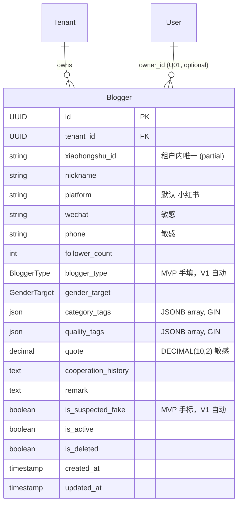

# U03 领域实体（Domain Entities）

> 单元：U03 — 博主库基础  
> 范围：Blogger 实体 + 4 个 Python Enum  
> 不含：BloggerTagService（U10b / V1）、自动博主类型计算（U10b）、假号自动判定（U10b）

---

## 1. 实体清单

| # | 实体 | 类型 | 多租户 | 说明 |
|---|---|---|---|---|
| 1 | `Blogger` | TenantScopedModel | ✅ | 博主基础信息表 |
| 2 | `BloggerType` | Python Enum | — | 博主类型（素人 / KOC / KOL / 明星） |
| 3 | `Platform` | Python Enum | — | 平台（小红书 / 抖音 / 快手 / B站） |
| 4 | `GenderTarget` | Python Enum | — | 受众性别（女性 / 男性 / 中性） |

`category_tags` / `quality_tags` 用 JSONB 数组存自由字符串，不单独建表（V1 视实际需要再升级为字典）。

---

## 2. ER 图（Mermaid）



---

## 3. Blogger 字段详细

| 字段 | 类型 | 必填 | 唯一 | 默认 | 说明 |
|---|---|---|---|---|---|
| `id` | UUID | ✅ | ✅ | `gen_random_uuid()` | 主键 |
| `tenant_id` | UUID | ✅ | (id, tenant_id) | 来自 ctx | 租户外键（继承 TenantScopedModel） |
| `xiaohongshu_id` | VARCHAR(64) | ✅ | (tenant_id, xiaohongshu_id) UNIQUE WHERE is_deleted=false | — | 小红书账号 ID（业务键） |
| `nickname` | VARCHAR(128) | ✅ | — | — | 博主昵称 |
| `platform` | VARCHAR(16) | ✅ | — | `'小红书'` | Platform 枚举 |
| `wechat` | VARCHAR(64) | ❌ | — | NULL | 微信号（敏感字段） |
| `phone` | VARCHAR(32) | ❌ | — | NULL | 手机号（敏感字段） |
| `follower_count` | INTEGER | ❌ | — | NULL | 粉丝量（≥ 0） |
| `blogger_type` | VARCHAR(16) | ❌ | — | NULL | BloggerType 枚举（MVP 手填） |
| `gender_target` | VARCHAR(16) | ❌ | — | NULL | GenderTarget 枚举 |
| `category_tags` | JSONB | ✅ | — | `'[]'::jsonb` | 内容类目标签数组 |
| `quality_tags` | JSONB | ✅ | — | `'[]'::jsonb` | 质量标签数组（U10b 自动） |
| `quote` | DECIMAL(10,2) | ❌ | — | NULL | 合作报价（敏感字段，按角色屏蔽） |
| `cooperation_history` | TEXT | ❌ | — | NULL | 合作历史备注 |
| `remark` | TEXT | ❌ | — | NULL | 备注 |
| `is_suspected_fake` | BOOLEAN | ✅ | — | `false` | 假号嫌疑标记（MVP 手标，V1 自动） |
| `is_active` | BOOLEAN | ✅ | — | `true` | 启用 |
| `is_deleted` | BOOLEAN | ✅ | — | `false` | 软删 |
| `created_at` | TIMESTAMPTZ | ✅ | — | `now()` | — |
| `updated_at` | TIMESTAMPTZ | ✅ | — | `now()` | — |

---

## 4. 索引清单

| 索引 | 类型 | 列 / 表达式 | 用途 |
|---|---|---|---|
| `uq_blogger_xiaohongshu_id` | B-tree UNIQUE (partial) | `(tenant_id, xiaohongshu_id) WHERE is_deleted = false` | 业务键唯一（软删后释放） |
| `idx_blogger_tenant_active` | B-tree | `(tenant_id, is_active, is_deleted)` | 列表过滤 |
| `idx_blogger_type` | B-tree | `(tenant_id, blogger_type)` | 按博主类型筛选 |
| `idx_blogger_follower_count` | B-tree | `(tenant_id, follower_count)` | 范围查询（min/max） |
| `idx_blogger_platform` | B-tree | `(tenant_id, platform)` | 跨平台扩展预留（V1+） |
| `idx_blogger_nickname_trgm` | **GIN trgm** (partial) | `(nickname gin_trgm_ops) WHERE is_deleted = false` | 昵称 ILIKE 搜索（数据量小，GIN 仅 nickname 单字段足够） |
| `idx_blogger_xhs_id_trgm` | **GIN trgm** (partial) | `(xiaohongshu_id gin_trgm_ops) WHERE is_deleted = false` | xiaohongshu_id ILIKE 搜索 |
| `idx_blogger_category_tags` | **GIN JSONB** | `(category_tags)` | tag 包含查询 |
| `idx_blogger_quality_tags` | **GIN JSONB** | `(quality_tags)` | tag 包含查询 |
| `idx_blogger_suspected_fake` | B-tree (partial) | `(tenant_id) WHERE is_suspected_fake = true` | 假号筛选（数量少） |

**索引大小预估**：1763 博主 → < 5MB 总计（远小于 U02）。

---

## 5. 枚举定义

### 5.1 BloggerType
```python
class BloggerType(str, Enum):
    """博主类型。MVP 阶段 PR 手动选择，V1 / U10b 阶段系统按粉丝量自动计算。"""

    AMATEUR = "素人"      # < 1k
    KOC = "KOC"           # 1k - 10k
    KOL = "KOL"           # 10k - 100w
    CELEBRITY = "明星"    # 100w+
```

### 5.2 Platform
```python
class Platform(str, Enum):
    """博主所属平台。MVP 阶段仅小红书，V1+ 扩展。"""

    XIAOHONGSHU = "小红书"
    DOUYIN = "抖音"
    KUAISHOU = "快手"
    BILIBILI = "B站"
```

### 5.3 GenderTarget
```python
class GenderTarget(str, Enum):
    """博主受众性别。"""

    FEMALE = "女性"
    MALE = "男性"
    UNISEX = "中性"
```

---

## 6. 与 U01 / U02 的关系

| 关系 | 来源单元 | 引用方式 |
|---|---|---|
| `tenant_id` | U01 | 继承 `TenantScopedModel` |
| 审计 | U01 | `@audit("blogger.create/update/...")` 装饰器 + AuditService |
| 权限装饰器 | U01 | `@require_permission("blogger:read/write/delete")` |
| 错误码 | U01 | 继承 ResourceConflictError / ValidationError / PermissionDeniedError |
| 字段权限模式 | **U02** | 复用 `legacy_field_permissions.py` 模式（QUOTE_VISIBLE_ROLES / CONTACT_VISIBLE_ROLES） |
| 审计脱敏模式 | **U02** | 复用 `*_changed: true` 标记策略（quote / wechat / phone） |
| upsert 模式 | **U02** | 复用 `pg_insert.on_conflict_do_update` + partial UNIQUE 对齐 |
| 软删引用检查 | **U02** | 复用 `check_references()` 接口 + TODO U04 注释 |

**与 U02 product 完全独立**：
- 无外键关联（不依赖 Style / Sku）
- 不共享 service / repository
- 后续 U04 promotion 才同时引用 sku 和 blogger

---

## 7. 演化路线图

| 阶段 | 单元 | 演化项 |
|---|---|---|
| **MVP** | U03（本单元） | 上述全部字段 + 手填 blogger_type / quality_tags / is_suspected_fake |
| **MVP** | U06c | 通过 `BloggerService.upsert_by_xiaohongshu_id()` 内部 API 批量导入 |
| **MVP** | U04 | promotion 表 FK 到 blogger.id；快照 `quote` 到 promotion 表 |
| **V1** | U09 | 字段级权限改造：`quote` / `wechat` / `phone` 从 service 硬编码改为 `Permission.field_filter()`；移除 `legacy_field_permissions.py` |
| **V1** | U10b | BloggerTagService 自动计算：blogger_type（按 follower_count）/ quality_tags / is_suspected_fake |

---

## 8. 一致性校验

| 校验 | 结果 |
|---|---|
| 继承 `TenantScopedModel`（U01 已实现） | ✅ |
| 业务键 partial UNIQUE（软删后释放） | ✅ |
| 字段级权限模式与 U02 一致 | ✅ |
| 审计脱敏模式与 U02 一致 | ✅ |
| GIN JSONB 索引支撑 tag 查询 | ✅ |
| GIN trgm 索引仅 nickname / xiaohongshu_id 单字段（数据量小，无需拼接表达式） | ✅ |
| 与 U04 / U10b 演化路径预留 | ✅ |
