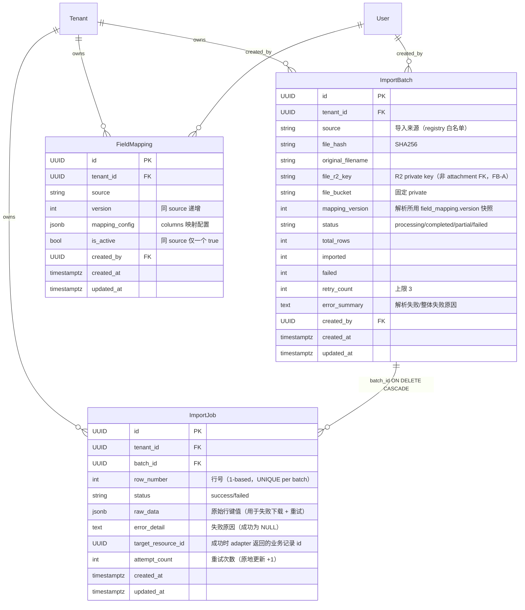

# U06a 领域实体（Domain Entities）

> 单元：U06a — 统一导入框架  
> 范围：ImportBatch + ImportJob + FieldMapping + 3 Python Enum + ImportAdapter 协议 + ImportAdapterRegistry  
> 不含：具体业务 Adapter（U06b/c/d/e）；credential（U12）；crawler_task / data_quality_issue（U13）  
> **关键：不使用 U05 的 Attachment ORM / 不建 attachment FK**（FB-A）；import 原始文件用 U01 原生 R2 helper，import_batch 直接存 `file_r2_key`

---

## 1. 实体清单

| # | 实体 | 类型 | 多租户 | 说明 |
|---|---|---|---|---|
| 1 | `ImportBatch` | TenantScopedModel | ✅ | 导入批次（一次上传 = 一个 batch） |
| 2 | `ImportJob` | TenantScopedModel | ✅ | 导入行级结果（每行一条，便于精确重试/下载） |
| 3 | `FieldMapping` | TenantScopedModel | ✅ | 字段映射版本（同 source 多版本，仅一个 active） |
| 4 | `ImportBatchStatus` | Python Enum | — | 4 状态（processing / completed / partial / failed） |
| 5 | `ImportJobStatus` | Python Enum | — | 2 值（success / failed） |
| 6 | `ImportSource` | Python Enum | — | 来源白名单（占位，U06b-e 扩展具体值） |

非实体框架契约：
- `ImportAdapter`（Protocol）— 下游 U06b/c/d/e 实现
- `ImportAdapterRegistry`（进程内注册中心）

衍生/计算（不持久化）：
- 失败明细 CSV（下载时实时生成，StreamingResponse，不落库）
- batch 进度百分比（前端按 imported+failed / total_rows 计算）

> **无领域事件**：U06a 是导入框架，行级 upsert 委托给业务 Adapter，业务事件（如 SettlementRequested）由各业务 service 内部触发，导入框架不直接发事件。

---

## 2. ER 图（Mermaid）



---

## 3. ImportBatch（导入批次）

继承 `TenantScopedModel`（自动 id / tenant_id / created_at / updated_at + RLS）。

| 字段 | 类型 | 约束 | 说明 |
|---|---|---|---|
| `source` | VARCHAR(32) | NOT NULL | 导入来源，必须 ∈ registry 白名单（upload 时校验） |
| `file_hash` | VARCHAR(64) | NOT NULL | 文件内容 SHA256（hex） |
| `original_filename` | VARCHAR(255) | NOT NULL | 用户上传的原始文件名（仅展示/下载命名） |
| `file_r2_key` | VARCHAR(512) | NOT NULL | R2 private 桶 key = `imports/{tenant_id}/{batch_id}/{safe_filename}`（**非 attachment FK**，FB-A/FB-B） |
| `file_bucket` | VARCHAR(16) | NOT NULL DEFAULT 'private' | 固定 private（CHECK in 桶白名单） |
| `mapping_version` | INTEGER | NULL | 解析所用 field_mapping.version 快照（NULL = 无映射/恒等映射） |
| `status` | VARCHAR(16) | NOT NULL DEFAULT 'processing' | ImportBatchStatus（FB-D：无 pending） |
| `total_rows` | INTEGER | NOT NULL DEFAULT 0 | 解析出的数据行数（不含表头） |
| `imported` | INTEGER | NOT NULL DEFAULT 0 | 成功入库行数 |
| `failed` | INTEGER | NOT NULL DEFAULT 0 | 失败行数 |
| `retry_count` | INTEGER | NOT NULL DEFAULT 0 | 重试次数（上限 3，enqueue 前递增，FB-E） |
| `error_summary` | TEXT | NULL | 解析失败/整体失败的脱敏原因 |
| `created_by` | UUID | FK→user ON DELETE SET NULL | 上传者 |

**约束**：
- `UNIQUE(tenant_id, source, file_hash)` 永久（FB-D 去重；同租户同来源同文件 → 409）
- `CHECK(status IN ('processing','completed','partial','failed'))`
- `CHECK(file_bucket IN ('public','private','credentials','backups'))`
- `CHECK(total_rows >= 0 AND imported >= 0 AND failed >= 0)`
- `CHECK(retry_count >= 0 AND retry_count <= 3)`

**索引**：
- `idx_import_batch_tenant_status`(tenant_id, status, created_at DESC)（列表）
- `idx_import_batch_source`(tenant_id, source, created_at DESC)
- `UNIQUE(tenant_id, source, file_hash)`（去重 + 查询）

> **不含 attachment FK**（FB-A）：原始文件通过 U01 `AttachmentService.upload_bytes("private", file_r2_key, ...)` 写入；下载/重读用 `get_signed_url("private", file_r2_key)` 或 client.get_object；删除（清理）用 `delete("private", file_r2_key)`。完全不经 Attachment ORM 表与 ALLOWED_PURPOSES 白名单。

---

## 4. ImportJob（导入行级结果）

| 字段 | 类型 | 约束 | 说明 |
|---|---|---|---|
| `batch_id` | UUID | FK→import_batch ON DELETE CASCADE NOT NULL | 所属批次 |
| `row_number` | INTEGER | NOT NULL | 文件内行号（1-based，不含表头） |
| `status` | VARCHAR(16) | NOT NULL | ImportJobStatus（success/failed） |
| `raw_data` | JSONB | NOT NULL | 原始行键值（失败下载 + 重试用） |
| `error_detail` | TEXT | NULL | 失败原因（成功为 NULL；含 validate 错误 / upsert 异常类型，脱敏） |
| `target_resource_id` | UUID | NULL | 成功时 adapter 返回的业务记录 id |
| `attempt_count` | INTEGER | NOT NULL DEFAULT 1 | 尝试次数（重试原地 +1，FB-E） |

**约束**：
- `UNIQUE(batch_id, row_number)`（FB-E：保证行幂等 + 重试原地更新定位）
- `CHECK(status IN ('success','failed'))`
- `CHECK(attempt_count >= 1)`

**索引**：
- `idx_import_job_batch_status`(tenant_id, batch_id, status)（汇总 + 失败下载 + 仅 failed 行重试）

> **仅持久化数据行**（成功+失败都建一条），不为表头/空行建 job。失败下载和"仅重试 failed 行"都靠 `status='failed'` 过滤 + `raw_data` 还原。

---

## 5. FieldMapping（字段映射版本）

| 字段 | 类型 | 约束 | 说明 |
|---|---|---|---|
| `source` | VARCHAR(32) | NOT NULL | 导入来源 |
| `version` | INTEGER | NOT NULL | 版本号（同 source 从 1 递增） |
| `mapping_config` | JSONB | NOT NULL | 列映射配置（见下） |
| `is_active` | BOOLEAN | NOT NULL DEFAULT false | 同 source 仅一个 true（生效版本） |
| `created_by` | UUID | FK→user ON DELETE SET NULL | 创建者（管理员） |

**mapping_config 结构**：
```json
{
  "columns": [
    {"source_col": "商品编码", "target_field": "style_code", "required": true,  "type": "str",     "transform": null},
    {"source_col": "成本价",   "target_field": "cost_price",  "required": false, "type": "decimal", "transform": null},
    {"source_col": "上架日期", "target_field": "listed_on",   "required": false, "type": "date",    "transform": "%Y/%m/%d"}
  ]
}
```
- `type` ∈ {str, int, decimal, date, datetime, bool}
- `transform`：date/datetime 的 strptime 格式；其他类型可空
- Adapter 的 `parse_row` 按此把原始列名 → 目标字段 + 类型转换

**约束**：
- `UNIQUE(tenant_id, source, version)`
- 部分唯一 `UNIQUE(tenant_id, source) WHERE is_active`（同 source 仅一个 active；新建 v_next 时把旧 active 置 false，EP07-S09）
- `CHECK(version >= 1)`

**索引**：
- `idx_field_mapping_active`(tenant_id, source, is_active)

> 历史 batch 用 `import_batch.mapping_version` 快照所用版本（EP07-S09："查询历史 batch 时记录使用的版本"）。

---

## 6. Python Enum

```python
class ImportBatchStatus(str, Enum):
    PROCESSING = "processing"   # upload 即创建 + Celery 解析中（FB-D 无 pending）
    COMPLETED = "completed"     # 全部行成功
    PARTIAL = "partial"         # 部分行失败（有 import_job.failed 行）
    FAILED = "failed"           # 解析失败 / 全行失败 / Adapter 缺失

class ImportJobStatus(str, Enum):
    SUCCESS = "success"
    FAILED = "failed"

class ImportSource(str, Enum):
    """来源白名单占位。U06b/c/d/e 在各自模块扩展并 register。
    本枚举仅列 U06a 已知占位，实际有效集合 = ImportAdapterRegistry 注册的 source。
    """
    # U06b: MANUAL_STYLE_SKU = "manual_style_sku"
    # U06c: MANUAL_BLOGGER = "manual_blogger"
    # U06d: MANUAL_PROMOTION = "manual_promotion"
    # U06e: MANUAL_SETTLEMENT = "manual_settlement"
    # （U06a 不固化具体值，避免与 Adapter 注册重复维护；以 registry 为准）
```

> **source 有效性以 registry 为准**（FB：upload 校验 `source ∈ registry.keys()`）。ImportSource 枚举仅作文档占位，不强制限制（避免 U06a 改一次、U06b-e 各改一次的双重维护）。

---

## 7. ImportAdapter 协议 + Registry（框架契约，FB-C）

```python
# modules/importer/adapter.py
from typing import Any, Protocol
from uuid import UUID
from sqlalchemy.ext.asyncio import AsyncSession

class ImportAdapter(Protocol):
    source: str          # 来源标识（注册键）
    target_table: str    # 目标表名（审计/展示）

    def parse_row(self, row: dict[str, Any], mapping: "FieldMapping | None") -> dict[str, Any]:
        """原始行 → 目标字段（按 mapping 映射列名 + 类型转换）。纯函数，不碰 DB。"""

    def validate(self, parsed: dict[str, Any]) -> list[str]:
        """返回错误描述列表（空 = 通过）。纯函数。"""

    async def upsert(
        self,
        parsed: dict[str, Any],
        *,
        session: AsyncSession,    # runner 持有事务边界并传入（FB-C）
        tenant_id: UUID,          # 显式租户（worker 无 HTTP CurrentUser）
        actor_id: UUID | None,    # = batch.created_by
    ) -> tuple[UUID, bool]:
        """幂等 upsert（按业务键）。返回 (resource_id, is_inserted)。
        不自行 commit — runner 控制 per-row 事务。"""
```

```python
# modules/importer/registry.py
class ImportAdapterRegistry:
    _adapters: dict[str, ImportAdapter] = {}

    @classmethod
    def register(cls, adapter: ImportAdapter) -> None: ...
    @classmethod
    def get(cls, source: str) -> ImportAdapter | None: ...
    @classmethod
    def sources(cls) -> frozenset[str]: ...
    @classmethod
    def clear(cls) -> None: ...   # 测试用
```

注册时机（与 U05 listener 同模式）：
- U06b/c/d/e 各自 `register()` 函数调用 `ImportAdapterRegistry.register(StyleSkuImportAdapter())` 等
- `main.py` lifespan 内 `register_import_adapters()`（缺失模块 ModuleNotFoundError → warning，不阻塞框架启动；upload 时 source 白名单兜底）

---

## 8. 演化路线

| 单元 | 扩展 |
|---|---|
| U06b | `StyleSkuImportAdapter`（target=style/sku，按 style_code/sku_code 幂等，复用 U02 upsert_atomic） |
| U06c | `BloggerImportAdapter`（按 xiaohongshu_id 幂等，复用 U03 upsert_atomic） |
| U06d | `PromotionImportAdapter`（按 internal_code 幂等，复用 U04） |
| U06e | `SettlementImportAdapter`（按 settlement_no 幂等，复用 U05） |
| U12 | credential 表 + 加密（与 importer 解耦，供 U13 用） |
| U13 | crawler_task + Worker pull + Qianniu/Wanxiangtai/Huitun Adapter + data_quality_issue 看板；自动采集上传后复用本框架的 run_import_batch |
| V1 | import_job 分区（10 万级）；force 重导标志（绕过 hash 去重）；attachment 统一治理评估（若届时决定 import 文件纳入 attachment，再迁 file_r2_key → attachment_id） |

---

## 9. 一致性校验

| 校验 | 结果 |
|---|---|
| 依赖严格 = U01（不引用 U05 Attachment ORM，FB-A） | ✅ file_r2_key 直存，用 U01 R2 helper |
| 不涉 ALLOWED_PURPOSES（FB-B） | ✅ 不走 attachment ORM/通用 API |
| Adapter 契约含 session/tenant_id/actor_id（FB-C） | ✅ §7 |
| 状态机无 pending（FB-D） | ✅ ImportBatchStatus 4 状态 |
| 去重 UNIQUE(tenant_id, source, file_hash)（FB-D） | ✅ §3 |
| UNIQUE(batch_id, row_number) + attempt_count（FB-E） | ✅ §4 |
| field_mapping 同 source 单 active（EP07-S09） | ✅ §5 部分唯一 |
| 故事覆盖 EP07-S07~S10 | ✅ 见 business-rules / business-logic-model |
