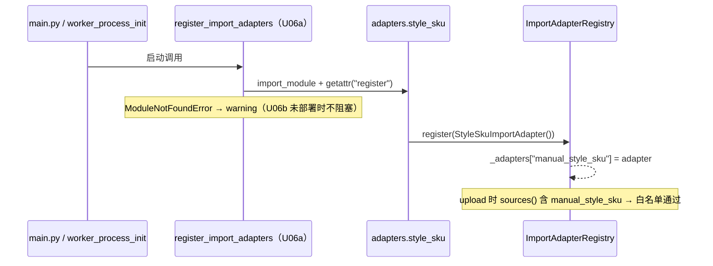
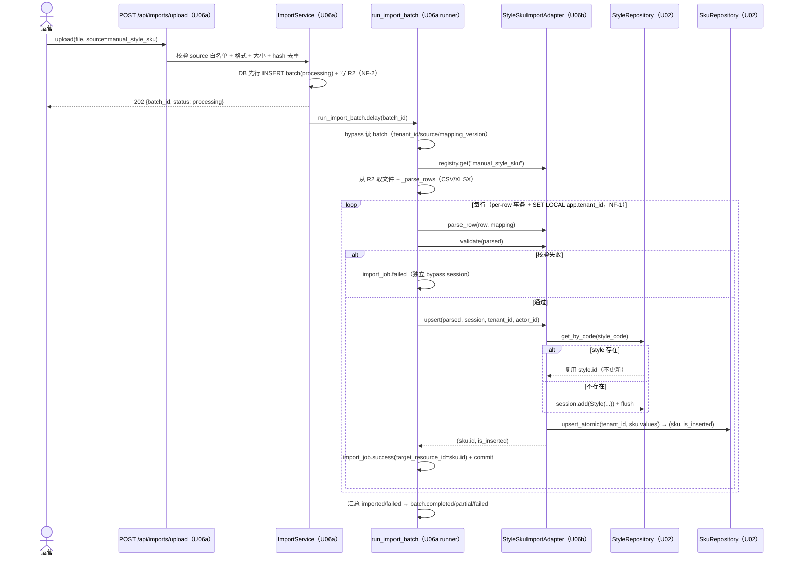
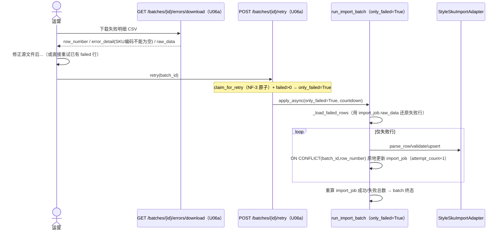
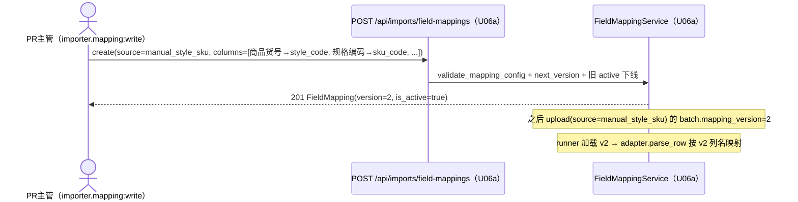
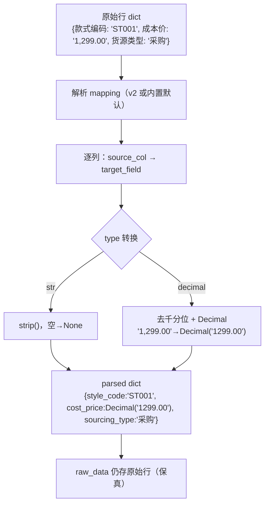

# U06b 业务逻辑模型（Business Logic Model）

> 单元：U06b — 商品/SKU 导入适配器
> 范围：5 个用例（注册 / 端到端导入 / 行级失败重试 / 自定义映射 / 解析转换）
> 所有用例复用 U06a 框架编排；本单元聚焦 StyleSkuImportAdapter 在 runner per-row 事务内的行为

---

## UC-1 适配器注册（启动期）

**触发**：HTTP 进程 lifespan / Celery worker_process_init（U06a register_import_adapters）

**关键点**：U06a 的 register_import_adapters 已含 `app.modules.importer.adapters.style_sku`；U06b 落地模块 + `register()` 后两进程自动注册（HTTP 用于 upload 白名单校验，worker 用于 runner 取 adapter）。

---

## UC-2 端到端导入（主流程）

**前置**：运营登录（importer.batch:write）；准备款式-SKU 平铺 CSV/XLSX

**汇总规则**（U06a runner）：failed=0 且 total>0 → completed；imported=0 → failed；否则 partial。

---

## UC-3 行级失败 + 重试（FB-E only_failed）

**场景**：CSV 含一行缺 SKU编码 → 该行 failed，其余成功 → batch=partial

> only_failed 路径用 import_job.raw_data 还原原始行；重试是否成功取决于该行数据本身（如 raw_data 本就缺 sku_code，则重试仍失败，需运营改源文件重新 upload 新 batch）。

---

## UC-4 自定义字段映射覆盖

**场景**：某租户的导出文件列名是"商品货号/规格编码"而非默认"款式编码/SKU编码"

> 历史 batch 在 import_batch.mapping_version 记录所用版本（可追溯）；adapter parse_row 收到 runner 按版本加载的 mapping；mapping=None（无 active 且 batch.mapping_version=NULL）→ 回退内置默认映射。

---

## UC-5 解析与类型转换（parse_row 内部）

---

## 用例汇总

| UC | 名称 | 复用 U06a | U06b 新增 |
|---|---|---|---|
| UC-1 | 适配器注册 | register_import_adapters / Registry | register() + adapter 类 |
| UC-2 | 端到端导入 | upload / runner / 8 端点 | parse_row / validate / upsert |
| UC-3 | 行级失败重试 | retry / claim / 下载 / only_failed | adapter 行为（缺字段 → failed） |
| UC-4 | 自定义映射 | field-mapping API / 版本管理 | manual_style_sku 列定义 |
| UC-5 | 解析转换 | runner _parse_rows | 类型转换 + 默认映射回退 |

---

## 端到端验收样本（测试 fixture 设计）

样本 CSV（`manual_style_sku` 默认表头）：

| 款式编码 | 款式名称 | 类目 | SKU编码 | 颜色 | 尺码 | 成本价 | 货源类型 | 预期 |
|---|---|---|---|---|---|---|---|---|
| ST-A | 连衣裙A | 连衣裙 | SKA-红-M | 红 | M | 39.90 | 自产 | 新建 style + sku（success） |
| ST-A | 连衣裙A | 连衣裙 | SKA-红-L | 红 | L | 39.90 | 自产 | 复用 style ST-A + 新 sku（success） |
| ST-B | 上衣B | 上衣 |  | 蓝 | M | 20.00 | 采购 | 缺 SKU编码 → failed |

预期 batch：total_rows=3, imported=2, failed=1, status=partial；import_job 第3行 error_detail 含"SKU编码不能为空"。
