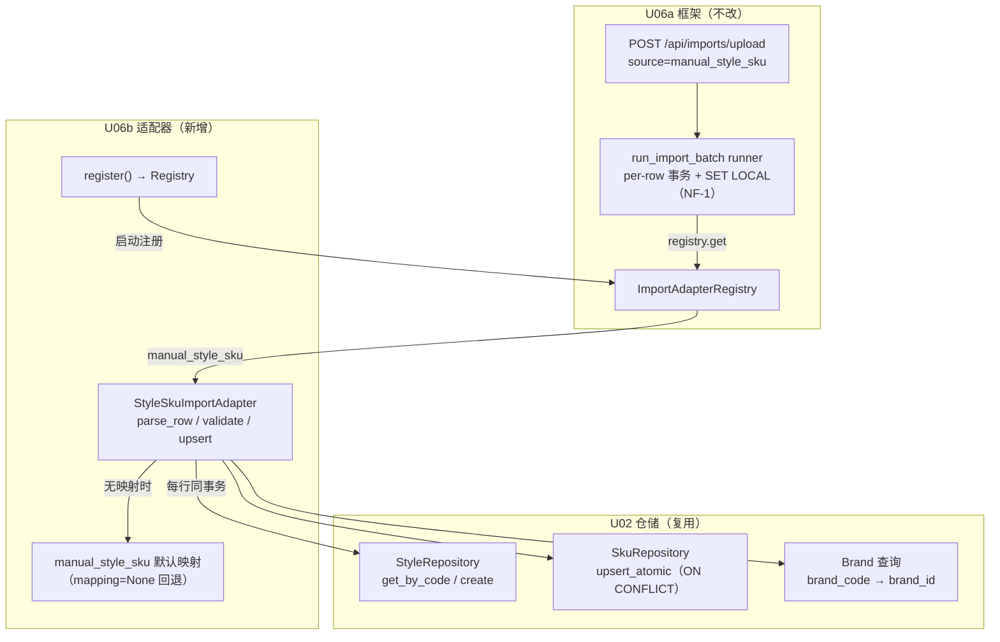
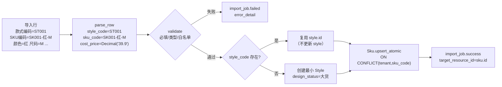

# U06b 领域实体（Domain Entities）

> 单元：U06b — 商品/SKU 导入适配器
> 范围：StyleSkuImportAdapter（满足 U06a `ImportAdapter` 协议）+ manual_style_sku 字段映射
> **无新表 / 无新 ORM 模型 / 无新 API / 无新 Celery 任务**
> 复用：U02（Style / Sku / Brand + StyleRepository / SkuRepository.upsert_atomic）+ U06a（import_batch / import_job / field_mapping + ImportAdapter 协议 + Registry + run_import_batch runner + 8 端点）

---

## 1. 实体清单

U06b 不引入任何新持久化实体。它新增**一个无状态适配器组件** + **一份字段映射数据**。

| # | 组件/数据 | 类型 | 持久化 | 说明 |
|---|---|---|---|---|
| 1 | `StyleSkuImportAdapter` | 适配器类（实现 U06a Protocol） | 否（无状态单例） | 把导入行映射为 Style + Sku 并 upsert |
| 2 | `manual_style_sku` 默认映射 | 代码内置常量（mapping=None 回退） | 否 | 中文表头 → style/sku 字段的恒等默认映射 |
| 3 | `manual_style_sku` 自定义映射 | U06a `field_mapping` 行（运营可建） | 是（复用 U06a 表） | 租户级覆盖默认列名 |

**复用的既有实体**（不改动）：
- U02：`Style`（style_code/style_name/category/season/brand_id/...）、`Sku`（sku_code/color/size/cost_price/purchase_price/base_price/sourcing_type）、`Brand`（brand_code → brand_id 查询）
- U06a：`ImportBatch`、`ImportJob`、`FieldMapping`（导入框架表，本单元仅消费）

> **无领域事件**：商品/SKU 导入是纯数据落库，不触发跨单元事件（与 U02 create_style/create_sku 一致，U02 本就无事件）。

---

## 2. 组件关系图（Mermaid）



> adapter 在 runner 的 per-row 事务内执行；runner 已设 `SET LOCAL app.tenant_id`（NF-1）+ ORM 钩子注入 tenant_id；adapter **不自行 commit**（FB-C）。

---

## 3. StyleSkuImportAdapter 契约

```python
# modules/importer/adapters/style_sku.py
class StyleSkuImportAdapter:
    source: str = "manual_style_sku"
    target_table: str = "style+sku"   # 一行同时落 style（复用/建）+ sku

    def parse_row(self, row: dict[str, Any], mapping: FieldMapping | None) -> dict[str, Any]:
        """按 mapping（或内置默认）把中文表头映射为 style/sku 字段 + 类型转换。纯函数。"""

    def validate(self, parsed: dict[str, Any]) -> list[str]:
        """返回错误描述列表（空=通过）。纯函数，不碰 DB。"""

    async def upsert(
        self, parsed: dict[str, Any], *,
        session: AsyncSession, tenant_id: UUID, actor_id: UUID | None,
    ) -> tuple[UUID, bool]:
        """style 按 style_code 复用/创建 → sku upsert_atomic。
        返回 (sku_id, is_inserted)。不自行 commit（runner 持有事务，FB-C）。"""


def register() -> None:
    """供 main.py / worker_process_init 调用，注册到 ImportAdapterRegistry。"""
    ImportAdapterRegistry.register(StyleSkuImportAdapter())
```

### 3.1 三方法职责

| 方法 | 输入 | 输出 | 副作用 |
|---|---|---|---|
| `parse_row` | 原始行 dict（CSV/XLSX 列名→值）+ mapping | 规范化 dict（style_*/sku_* + 类型转换后值） | 无（纯函数） |
| `validate` | parse_row 结果 | `list[str]` 错误（空=通过） | 无（纯函数） |
| `upsert` | parsed + session/tenant_id/actor_id | `(sku_id, is_inserted)` | 写 style（复用/建）+ sku（ON CONFLICT），不 commit |

### 3.2 返回值语义
- `resource_id` = **sku.id**（import_job.target_resource_id 记录 sku；一行主语义是落一个 SKU）
- `is_inserted` = **sku upsert 路径**（True=新建 sku，False=更新既有 sku）；style 复用/创建不影响该返回（仅审计 log）

---

## 4. manual_style_sku 默认字段映射

mapping=None（运营未自定义）时 adapter 用以下内置默认映射（中文表头 → 目标字段）：

| source_col（CSV 表头） | target_field | required | type | 目标 | 说明 |
|---|---|---|---|---|---|
| 款式编码 | style_code | ✅ | str | Style | 业务键（复用/创建依据） |
| 款式名称 | style_name | ✅ | str | Style | 创建 style 用 |
| 类目 | category | ✅ | str | Style.category | |
| 品牌编码 | brand_code | — | str | Brand 查询 | 软关联，查不到留空 |
| 季节 | season | — | str | Style.season | |
| SKU编码 | sku_code | ✅ | str | Sku | 业务键（upsert 依据） |
| 颜色 | color | ✅ | str | Sku.color | |
| 尺码 | size | ✅ | str | Sku.size | |
| 成本价 | cost_price | — | decimal | Sku.cost_price | ≥0，空→None |
| 采购价 | purchase_price | — | decimal | Sku.purchase_price | ≥0，空→None |
| 吊牌价 | base_price | — | decimal | Sku.base_price | ≥0，空→None |
| 货源类型 | sourcing_type | — | str | Sku.sourcing_type | 默认"自产"，∈{自产,采购,代发} |

### 4.1 mapping_config JSONB 结构（自定义覆盖时）

```json
{
  "columns": [
    {"source_col": "商品货号", "target_field": "style_code", "required": true, "type": "str", "transform": null},
    {"source_col": "规格编码", "target_field": "sku_code", "required": true, "type": "str", "transform": null},
    {"source_col": "成本", "target_field": "cost_price", "required": false, "type": "decimal", "transform": null}
  ]
}
```

> 运营通过 U06a `POST /api/imports/field-mappings`（source=manual_style_sku）建自定义 active 版本；历史 batch 在 `import_batch.mapping_version` 记录所用版本。adapter 收到 runner 传入的 `mapping`（按 batch.mapping_version 加载）；为 None 时回退内置默认（§4 表）。

---

## 5. 一行 → (Style + Sku) 实体映射



---

## 6. 类型转换与回退规则

| type | 转换 | 空值 |
|---|---|---|
| str | `str(v).strip()` | "" → None（可空字段）；必填字段空 → validate 报错 |
| decimal | 去千分位逗号 + `Decimal(v)` | "" / None → None |
| 其他 | 按 str 处理 | 同上 |

- **raw_data 保真**：import_job.raw_data 存**原始行**（未转换），供失败下载与重试（FB-E）
- **mapping=None 回退**：无 active 映射 + batch.mapping_version=NULL → 用 §4 内置默认映射
- 日期类字段本单元不涉及（商品/SKU 无导入日期字段）

---

## 7. 演化路线
- U06c/d/e：博主 / 推广 / 结算适配器（同 Adapter 协议，各自 source + 目标表）
- U10b（V1）：平台商品映射导入（platform_product_mapping，可能复用本 adapter 模式）
- V1：`update_style_on_import` 开关（允许导入更新既有 style 资料，当前默认复用不覆盖，Q4）
