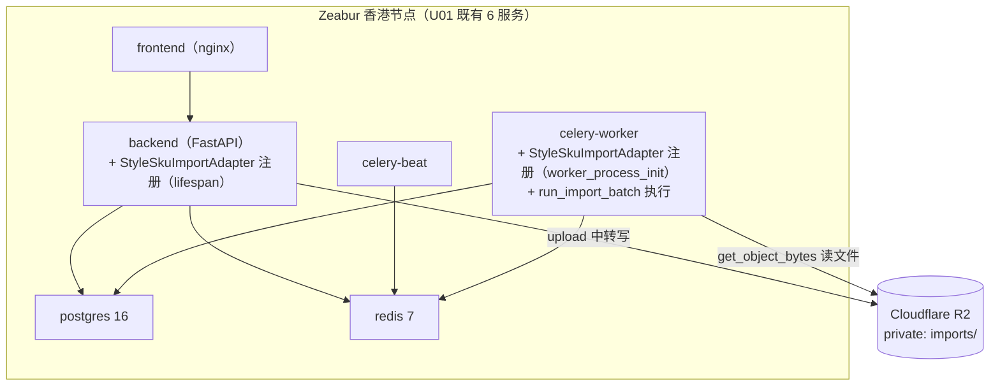

# U06b 部署架构（Deployment Architecture）

> 单元：U06b — 商品/SKU 导入适配器
> 结论：复用 U01 既有部署拓扑（6 服务），无新增/无变更。U06b adapter 在 backend + celery-worker 双进程加载。

---

## 1. 部署拓扑（复用 U01，无变更）

> U06b 不新增任何服务。adapter 是 backend + celery-worker 镜像内的应用代码，随镜像部署。

---

## 2. 双进程 Adapter 注册（复用 U06a NF-4）

| 进程 | 注册时机 | 用途 |
|---|---|---|
| backend（HTTP） | main.py lifespan → `register_import_adapters()` | upload(source=manual_style_sku) 白名单校验 |
| celery-worker | `worker_process_init` 信号 → `register_import_adapters()` | run_import_batch 内 `registry.get("manual_style_sku")` |

> `register_import_adapters`（U06a）已含 `app.modules.importer.adapters.style_sku` 模块路径。U06b 落地该模块后两进程自动注册，**main.py / celery_app.py 无改动**。

---

## 3. 部署步骤（随镜像更新，无 migration）

1. 合并 U06b 代码（adapters/style_sku.py + 测试）
2. CI 通过（lint + 测试 + import 框架校验 job 已存在）
3. backend + celery-worker 镜像构建（同一镜像，已含 openpyxl）
4. Zeabur 滚动更新 backend + celery-worker
5. 启动后两进程自动注册 manual_style_sku → upload 可用

> **无 alembic migrate 步骤**（无 DDL）；**无停机**（滚动更新）；**无部署顺序约束**（U02/U06a 已在线）。

---

## 4. 监控（复用 U06a）

| 指标 | 来源 | U06b 观测方式 |
|---|---|---|
| import_batch_total{source="manual_style_sku", status} | U06a | 商品导入批次成功/失败/部分 |
| import_rows_total{source="manual_style_sku", result} | U06a | 行级成功/失败计数 |
| import_batch_duration_seconds{source="manual_style_sku"} | U06a | 导入耗时分布 |
| import_file_size_bytes{source="manual_style_sku"} | U06a | 上传文件大小 |
| import_retry_total{source="manual_style_sku"} | U06a | 重试触发 |

- Sentry：复用 module=importer tag（解析致命失败 / adapter 异常）
- 无新告警规则（V1 评估按 source 设阈值）

---

## 5. 容量与伸缩（复用 U01/U06a）
- 商品导入非高频（每日数十次），复用 default 队列 + U01 worker concurrency=2
- 单 batch ≤ 5 万行（U06a IMPORT_MAX_ROWS），无 U06b 特有伸缩需求
- R2 imports/ 文件 MVP 保留（U06a 策略），无新生命周期

---

## 6. 一致性校验

| 校验 | 结果 |
|---|---|
| 复用 U01 6 服务拓扑无变更 | ✅ §1 |
| 双进程注册复用 U06a（main.py 不改） | ✅ §2 |
| 部署无 migration / 无停机 / 无顺序约束 | ✅ §3 |
| 监控复用 U06a 5 指标（source label） | ✅ §4 |
| 无新 Zeabur 服务 / 无新容量需求 | ✅ §1 + §5 |
