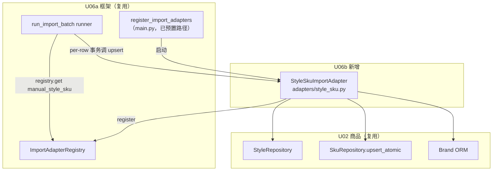

# U06b 逻辑组件（Logical Components）

> 单元：U06b — 商品/SKU 导入适配器
> 范围：1 个新组件（StyleSkuImportAdapter）+ 复用 U02/U06a 组件清单 + 注册序列
> **无新表 / 无新端点 / 无新 Celery 任务 / 无 main.py·celery_app.py 改动**

---

## 1. 组件清单

### 1.1 新建（modules/importer/adapters/）

| 组件 | 文件 | 职责 |
|---|---|---|
| 适配器包 | `adapters/__init__.py` | 包初始化（若 U06a 未建则新建） |
| StyleSku 适配器 | `adapters/style_sku.py` | `StyleSkuImportAdapter`（parse_row/validate/upsert）+ `_DEFAULT_COLUMNS` 内置默认映射 + `_to_decimal` + `_resolve_brand` + 模块级 `register()` |

### 1.2 复用（不改动）

| 组件 | 来源 | U06b 用法 |
|---|---|---|
| `ImportAdapter` Protocol | U06a adapter.py | StyleSkuImportAdapter 实现该协议 |
| `ImportAdapterRegistry` | U06a registry.py | register() 注册 manual_style_sku |
| `run_import_batch` runner | U06a tasks/import_tasks.py | 调用 adapter（per-row 事务 + SET LOCAL NF-1，不改 runner） |
| upload / batches / retry / errors / field-mapping API | U06a api.py | 复用 8 端点（upload 传 source=manual_style_sku） |
| ImportService / FieldMappingService | U06a service.py | 复用（adapter 无关） |
| `StyleRepository`（get_by_code / add） | U02 repository.py | style 复用/创建 |
| `SkuRepository.upsert_atomic` | U02 repository.py | sku ON CONFLICT upsert（P-U02-03） |
| `Style` / `Sku` / `Brand` ORM | U02 models.py | 目标表（不改 schema） |
| `register_import_adapters` | U06a main.py | 已预置 `app.modules.importer.adapters.style_sku` 模块路径 |

---

## 2. 依赖图（Mermaid）



---

## 3. 注册序列（复用 U06a，无新增）

```
[HTTP 进程] main.py lifespan startup:
  register_import_adapters()  # U06a 既有
    → import_module("app.modules.importer.adapters.style_sku")  # U06b 落地后存在
    → style_sku.register()
    → ImportAdapterRegistry.register(StyleSkuImportAdapter())
  # 之后 upload(source=manual_style_sku) 白名单校验通过

[Celery worker 进程] worker_process_init 信号:
  register_import_adapters()  # 同一函数（NF-4 双进程）
    → 同上注册
  # 之后 run_import_batch 内 registry.get("manual_style_sku") 命中
```

> U06a 的 `register_import_adapters` 已含 `app.modules.importer.adapters.style_sku`（ModuleNotFoundError 仅 warning）。U06b 落地该模块 + register() 后**两进程自动注册，main.py / celery_app.py 不改**。

---

## 4. 数据流（端到端）

```
upload(file, source=manual_style_sku)  ── U06a ImportService（DB 先行 + R2 + 建 batch processing）
   → run_import_batch.delay(batch_id)  ── U06a runner
       → registry.get("manual_style_sku") → StyleSkuImportAdapter
       → _parse_rows（U06a：csv/openpyxl）→ 行迭代
       → 每行 per-row 事务（SET LOCAL app.tenant_id，NF-1）:
            adapter.parse_row → validate → upsert
              ├─ StyleRepository.get_by_code / add+flush
              └─ SkuRepository.upsert_atomic → (sku, is_inserted)
            → import_job.success(target_resource_id=sku.id)（runner 写）
       → 汇总 → batch.completed/partial/failed（runner 写）
```

---

## 5. 测试组件（tests/）

| 组件 | 文件 | 覆盖 |
|---|---|---|
| unit | `tests/unit/test_style_sku_adapter.py` | parse_row（Decimal 千分位/空/各 type）+ validate（必填/数值/白名单/长度 各分支） |
| integration | `tests/integration/test_import_style_sku.py` | 注册真实 adapter → upload 样本 CSV → _run_import_batch → style/sku 入库 + 复用既有 style + Decimal 精度 + brand 软关联 + partial + retry only_failed + tenant_id 正确 |
| fixture | `tests/conftest.py`（追加） | manual_style_sku 样本 CSV（3 行：新建/复用/缺字段失败） |

---

## 6. 一致性校验

| 校验 | 结果 |
|---|---|
| 唯一新组件 = adapters/style_sku.py | ✅ §1.1 |
| 复用 U02 Repository + U06a 框架 | ✅ §1.2 |
| 注册复用 U06a（main.py 不改） | ✅ §3 |
| 无新表/端点/Celery 任务 | ✅ 全文 |
| 数据流经 runner per-row 事务（NF-1） | ✅ §4 |
