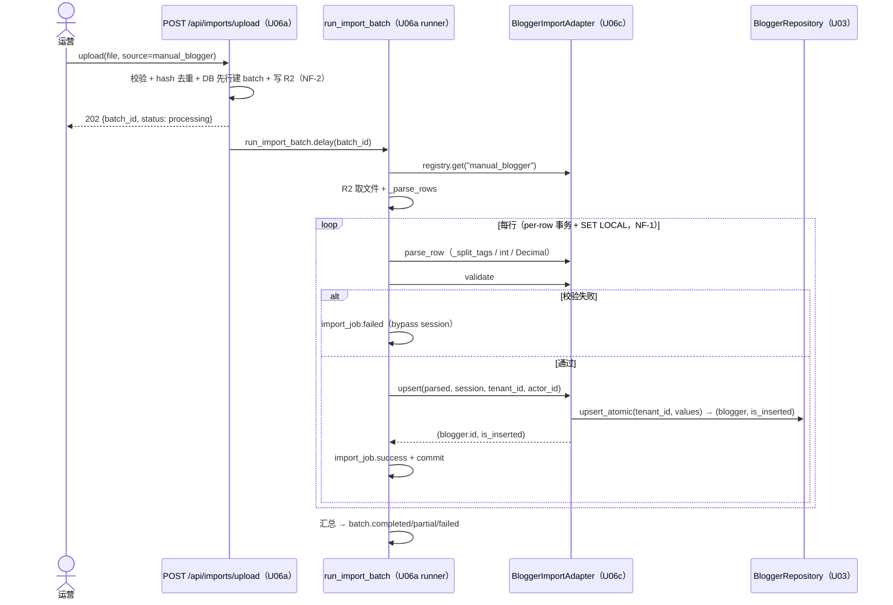
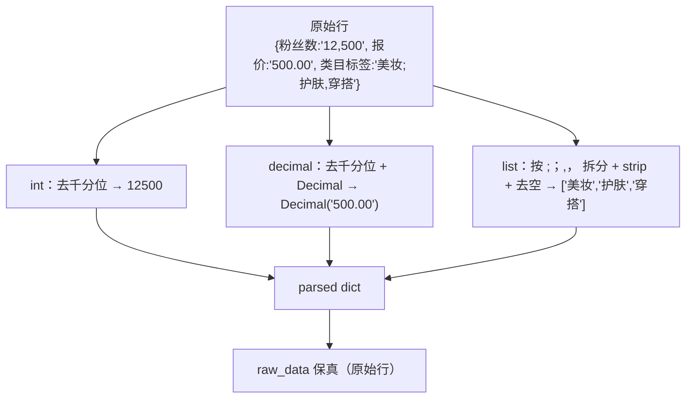

# U06c 业务逻辑模型（Business Logic Model）

> 单元：U06c — 博主导入适配器
> 范围：5 UC（注册 / 端到端导入 / 行级失败重试 / 自定义映射 / 标签与类型解析）
> 复用 U06a 框架编排；聚焦 BloggerImportAdapter 在 runner per-row 事务内的单实体 upsert

---

## UC-1 适配器注册（启动期）

复用 U06a register_import_adapters（main.py lifespan + worker_process_init）：
```
register_import_adapters() → import_module("app.modules.importer.adapters.blogger")
  → blogger.register() → ImportAdapterRegistry.register(BloggerImportAdapter())
  → upload(source=manual_blogger) 白名单通过
```
> main.py 已预置 `adapters.blogger` 路径；U06c 落地后两进程自动注册（NF-4）。

---

## UC-2 端到端导入（主流程）



> 单实体：upsert 仅一次 upsert_atomic（无 U06b 的 style get-or-create 步骤）。

---

## UC-3 行级失败 + 重试（FB-E only_failed）

缺 xiaohongshu_id 的行 → failed → batch=partial。下载失败明细 CSV → retry → claim_for_retry（NF-3）→ only_failed 重跑（用 raw_data 还原；ON CONFLICT(batch_id,row_number) 原地更新 attempt_count）。重试是否成功取决于行数据本身（raw_data 缺 xiaohongshu_id 则仍 failed）。

---

## UC-4 自定义字段映射覆盖

运营导出文件列名为"博主ID/粉丝量/标签" → 经 U06a `POST /api/imports/field-mappings`（source=manual_blogger）建 active 版本 → 之后 upload 的 batch.mapping_version 记录版本 → runner 加载 → adapter.parse_row 按自定义列名映射。

---

## UC-5 标签与类型解析（parse_row 内部）



---

## 用例汇总

| UC | 名称 | 复用 U06a | U06c 新增 |
|---|---|---|---|
| UC-1 | 注册 | register_import_adapters / Registry | register() + adapter |
| UC-2 | 端到端导入 | upload / runner / 8 端点 | parse_row / validate / upsert（单实体） |
| UC-3 | 行级失败重试 | retry / claim / 下载 / only_failed | adapter 行为 |
| UC-4 | 自定义映射 | field-mapping API | manual_blogger 列定义 |
| UC-5 | 标签/类型解析 | runner _parse_rows | _split_tags + int + Decimal |

---

## 端到端验收样本（测试 fixture 设计）

| 小红书ID | 昵称 | 粉丝数 | 报价 | 类目标签 | 预期 |
|---|---|---|---|---|---|
| xhs-A | 小美 | 12,500 | 500.00 | 美妆;护肤 | 新建 blogger（success，tags=['美妆','护肤']，follower=12500） |
| xhs-A | 小美改名 | 13000 | 600 | 美妆 | 同 xiaohongshu_id → UPDATE（is_inserted=False） |
| （空） | 无ID博主 | 1000 | 100 |  | 缺 xiaohongshu_id → failed |

预期 batch：total_rows=3, imported=2, failed=1, status=partial（第 2 行 UPDATE 第 1 行）；第 3 行 error_detail 含"小红书ID不能为空"。
