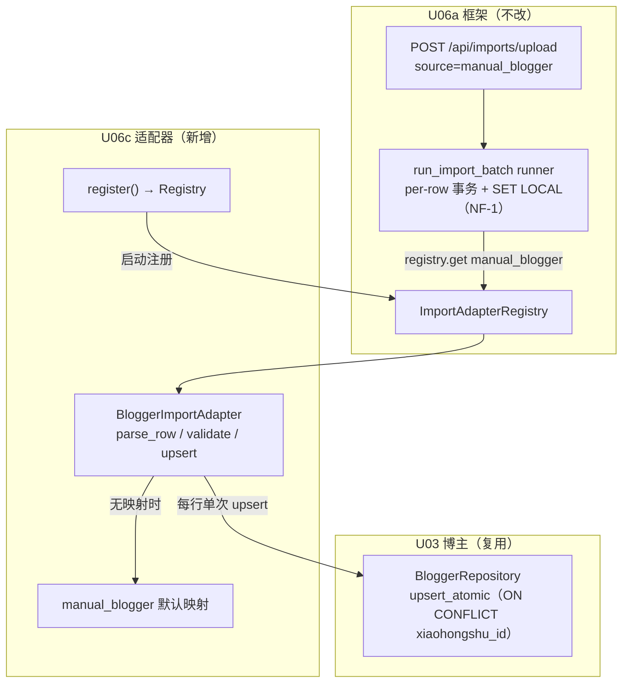
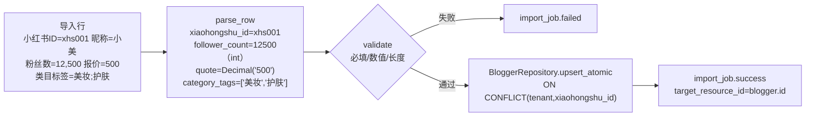

# U06c 领域实体（Domain Entities）

> 单元：U06c — 博主导入适配器
> 范围：BloggerImportAdapter（满足 U06a `ImportAdapter` 协议）+ manual_blogger 字段映射
> **无新表 / 无新 ORM 模型 / 无新 API / 无新 Celery 任务**
> 复用：U03（Blogger + BloggerRepository.upsert_atomic）+ U06a（import 框架 + 8 端点 + runner + Registry）

---

## 1. 实体清单

U06c 不引入新持久化实体。新增**一个无状态适配器** + **一份字段映射数据**。

| # | 组件/数据 | 类型 | 持久化 | 说明 |
|---|---|---|---|---|
| 1 | `BloggerImportAdapter` | 适配器类（实现 U06a Protocol） | 否 | 导入行映射为 Blogger 并 upsert |
| 2 | `manual_blogger` 默认映射 | 代码内置常量 | 否 | 中文表头 → blogger 字段恒等默认映射 |
| 3 | `manual_blogger` 自定义映射 | U06a field_mapping 行 | 是（复用 U06a 表） | 租户级覆盖列名 |

**复用既有实体**（不改动）：U03 `Blogger`（xiaohongshu_id/nickname/platform/wechat/phone/follower_count/blogger_type/gender_target/category_tags/quality_tags/quote/cooperation_history/remark/is_suspected_fake）；U06a import_batch/import_job/field_mapping。

> **无领域事件**：博主导入纯数据落库（与 U03 create_blogger 一致，无事件）。

---

## 2. 组件关系图（Mermaid）



---

## 3. BloggerImportAdapter 契约

```python
# modules/importer/adapters/blogger.py
class BloggerImportAdapter:
    source: str = "manual_blogger"
    target_table: str = "blogger"

    def parse_row(self, row, mapping) -> dict:        # 含 _split_tags / int / Decimal
    def validate(self, parsed) -> list[str]:          # 必填 + 数值 + 长度
    async def upsert(self, parsed, *, session, tenant_id, actor_id) -> tuple[UUID, bool]:
        # 单次 BloggerRepository.upsert_atomic（ON CONFLICT xiaohongshu_id）

def register() -> None:
    ImportAdapterRegistry.register(BloggerImportAdapter())
```

### 3.1 与 U06b 的关键差异
- **单实体**：upsert 仅一次 `upsert_atomic`（无 style get-or-create / 无 brand 关联）
- **标签 list 类型**：category_tags / quality_tags 分隔字符串 → JSONB 数组（新增 `_split_tags`）
- **Integer 类型**：follower_count（U06b 无 int 字段）
- **无 created_by**：U03 blogger 无 created_by 列，actor_id 不写入业务表

---

## 4. manual_blogger 默认字段映射

| source_col | target_field | required | type | 目标 |
|---|---|---|---|---|
| 小红书ID | xiaohongshu_id | ✅ | str | 业务键 |
| 昵称 | nickname | ✅ | str | |
| 平台 | platform | — | str | 默认"小红书" |
| 微信 | wechat | — | str | |
| 手机号 | phone | — | str | |
| 粉丝数 | follower_count | — | int | ≥0 |
| 博主类型 | blogger_type | — | str | |
| 性别投放 | gender_target | — | str | |
| 类目标签 | category_tags | — | list | 分隔串 → JSONB 数组 |
| 质量标签 | quality_tags | — | list | 分隔串 → JSONB 数组 |
| 报价 | quote | — | decimal | ≥0 |
| 合作历史 | cooperation_history | — | str | |
| 备注 | remark | — | str | |

### 4.1 mapping_config JSONB 结构（自定义覆盖）
```json
{"columns": [
  {"source_col": "博主ID", "target_field": "xiaohongshu_id", "required": true, "type": "str"},
  {"source_col": "粉丝量", "target_field": "follower_count", "required": false, "type": "int"},
  {"source_col": "标签", "target_field": "category_tags", "required": false, "type": "list"}
]}
```

---

## 5. 一行 → Blogger 实体映射



---

## 6. 类型转换规则

| type | 转换 | 空 |
|---|---|---|
| str | strip | "" → None |
| int | 去千分位 + int | "" → None；非法/负数 → validate 失败 |
| decimal | 去千分位 + Decimal（禁 float） | "" → None；非法/负数 → validate 失败 |
| list | 按 `;；,，` 拆分 + strip + 去空 | 空 → `[]` |

- raw_data 保真存原始行（失败下载/重试）
- mapping=None → 内置默认映射（§4）

---

## 7. 演化路线
- U06d/e：推广 / 结算适配器（同协议）
- V1：博主智能标签（U11）会扩展 category_tags / quality_tags 的自动生成（导入仅手工标签）
