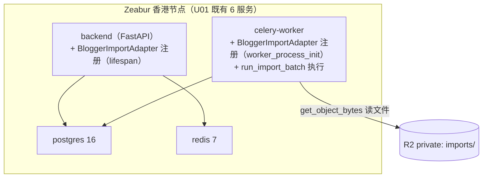

# U06c 部署架构（Deployment Architecture）

> 单元：U06c — 博主导入适配器
> 结论：复用 U01 既有部署拓扑（6 服务），无新增/无变更。

---

## 1. 部署拓扑（复用 U01，无变更）

> U06c 不新增服务。adapter 是 backend + celery-worker 镜像内的应用代码。

---

## 2. 双进程 Adapter 注册（复用 U06a NF-4）

| 进程 | 注册时机 | 用途 |
|---|---|---|
| backend | main.py lifespan → register_import_adapters() | upload(source=manual_blogger) 白名单校验 |
| celery-worker | worker_process_init → register_import_adapters() | run_import_batch 内 registry.get("manual_blogger") |

> main.py 已含 `app.modules.importer.adapters.blogger`。U06c 落地后两进程自动注册，main.py/celery_app.py 不改。

---

## 3. 部署步骤（随镜像更新，无 migration）
1. 合并 U06c 代码（adapters/blogger.py + 测试）
2. CI 通过（lint + 测试 + 既有 import 框架校验 job）
3. backend + celery-worker 镜像构建（已含 openpyxl）
4. Zeabur 滚动更新
5. 启动后两进程自动注册 manual_blogger → upload 可用

> 无 alembic migrate / 无停机 / 无部署顺序约束。

---

## 4. 监控（复用 U06a）
- 5 指标 `import_*{source="manual_blogger"}` 在 U01 通用 Grafana 切分
- Sentry module=importer tag；无新告警规则

---

## 5. 一致性校验

| 校验 | 结果 |
|---|---|
| 复用 U01 6 服务拓扑无变更 | ✅ §1 |
| 双进程注册复用 U06a（main.py 不改） | ✅ §2 |
| 部署无 migration / 无停机 | ✅ §3 |
| 监控复用 U06a 5 指标 | ✅ §4 |
