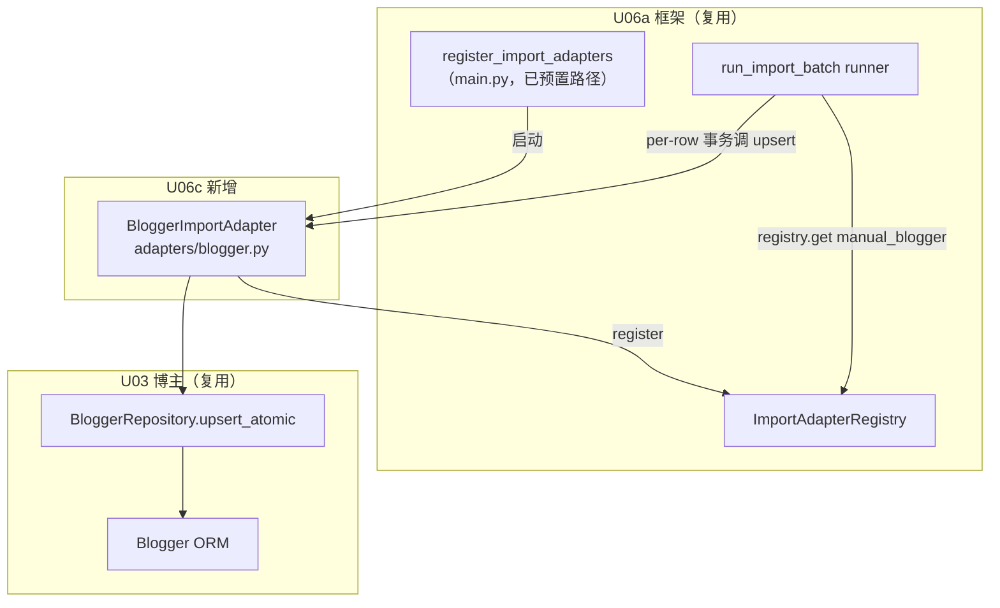

# U06c 逻辑组件（Logical Components）

> 单元：U06c — 博主导入适配器
> 范围：1 个新组件（BloggerImportAdapter）+ 复用 U03/U06a + 注册序列
> **无新表 / 无新端点 / 无新 Celery 任务 / 无 main.py·celery_app.py 改动**

---

## 1. 组件清单

### 1.1 新建（modules/importer/adapters/）

| 组件 | 文件 | 职责 |
|---|---|---|
| Blogger 适配器 | `adapters/blogger.py` | `BloggerImportAdapter`（parse_row/validate/upsert）+ `_DEFAULT_COLUMNS` 13 列 + `_split_tags` + `_to_int` + `_to_decimal` + `register()` |

> `adapters/__init__.py` 已由 U06b 创建（无需新建）。

### 1.2 复用（不改动）

| 组件 | 来源 | 用法 |
|---|---|---|
| ImportAdapter Protocol / Registry / runner / 8 端点 | U06a | 实现 + 注册 + 编排 |
| `BloggerRepository.upsert_atomic`（ON CONFLICT xiaohongshu_id） | U03 | blogger 单次 upsert |
| `Blogger` ORM | U03 | 目标表（不改 schema） |
| `register_import_adapters` | U06a main.py | 已含 `adapters.blogger` 路径 |
| `_to_decimal` 思路 | U06b | quote 解析（U06c 独立实现，避免跨 adapter 耦合） |

---

## 2. 依赖图（Mermaid）



---

## 3. 注册序列（复用 U06a，无新增）

```
[HTTP 进程] main.py lifespan: register_import_adapters()
  → import_module("app.modules.importer.adapters.blogger")
  → blogger.register() → ImportAdapterRegistry.register(BloggerImportAdapter())

[Celery worker] worker_process_init: register_import_adapters()（同上）
```

> main.py 已含 `app.modules.importer.adapters.blogger`（U06a 预置，ModuleNotFoundError 仅 warning）。U06c 落地后两进程自动注册，**main.py / celery_app.py 不改**。

---

## 4. 数据流（端到端）

```
upload(file, source=manual_blogger)  ── U06a ImportService（DB 先行 + R2 + 建 batch）
  → run_import_batch.delay  ── U06a runner
      → registry.get("manual_blogger") → BloggerImportAdapter
      → _parse_rows（csv/openpyxl）→ 行迭代
      → 每行 per-row 事务（SET LOCAL，NF-1）:
           adapter.parse_row（_split_tags/_to_int/_to_decimal）→ validate → upsert
             └─ BloggerRepository.upsert_atomic → (blogger, is_inserted)
           → import_job.success(target_resource_id=blogger.id)
      → 汇总 → batch.completed/partial/failed
```

---

## 5. 测试组件

| 组件 | 文件 | 覆盖 |
|---|---|---|
| unit | `tests/unit/test_blogger_adapter.py` | parse_row（_split_tags 多分隔符/int/Decimal）+ validate（必填/数值/长度） |
| integration | `tests/integration/test_import_blogger.py` | 注册真实 adapter → upload 样本 CSV → _run_import_batch → blogger 入库 + category_tags JSONB + 同 ID UPDATE + partial + tenant_id |

---

## 6. 一致性校验

| 校验 | 结果 |
|---|---|
| 唯一新组件 = adapters/blogger.py | ✅ §1.1 |
| 复用 U03 upsert_atomic + U06a 框架 | ✅ §1.2 |
| 注册复用 U06a（main.py 不改） | ✅ §3 |
| 无新表/端点/Celery 任务 | ✅ 全文 |
| 数据流经 runner per-row 事务（NF-1） | ✅ §4 |
