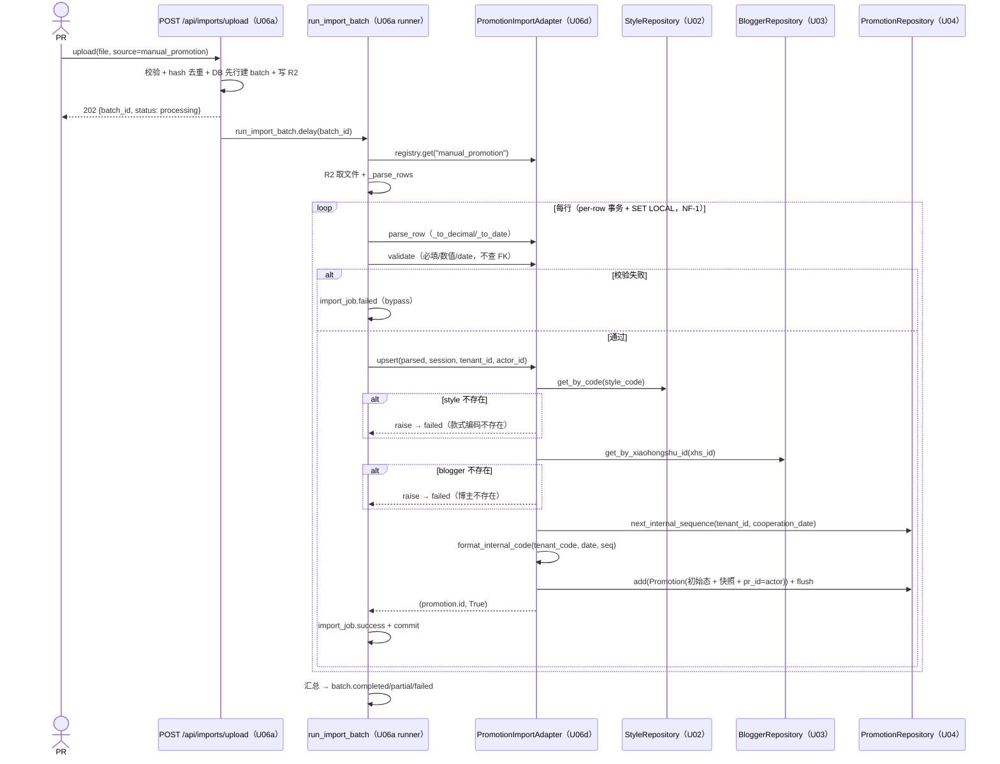
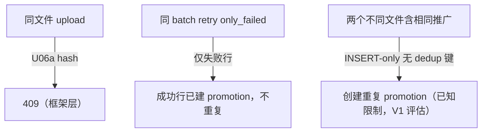

# U06d 业务逻辑模型（Business Logic Model）

> 单元：U06d — 推广导入适配器
> 范围：5 UC（注册 / 端到端导入含 FK 解析+序列+建 promotion / 行级失败 / 自定义映射 / 幂等语义）
> 聚焦 PromotionImportAdapter 在 runner per-row 事务内的 INSERT-only 编排

---

## UC-1 适配器注册（启动期）

复用 U06a register_import_adapters：
```
register_import_adapters() → import_module("app.modules.importer.adapters.promotion")
  → promotion.register() → ImportAdapterRegistry.register(PromotionImportAdapter())
```
> main.py 已预置 `adapters.promotion` 路径；落地后双进程自动注册（NF-4）。

---

## UC-2 端到端导入（主流程，INSERT-only + FK 解析）



---

## UC-3 行级失败（FK 缺失 / 序列溢出）

| 失败类型 | error_detail |
|---|---|
| style_code 不存在 | `款式编码 ST999 不存在` |
| xiaohongshu_id 不存在 | `博主 xhs999 不存在` |
| sku_code 提供但不存在 | `SKU编码 SK999 不存在` |
| 当天序号 >9999 | `当天推广序号已达上限` |
| 必填缺失 / 数值非法 / date 非法 | validate 文案 |

> 行失败 → import_job.failed（含 raw_data 供下载/重试）；per-row 事务隔离。retry only_failed：补齐 style/blogger 后**需重新 upload 新文件**（FK 数据修复在主数据侧；原 batch retry 仅重跑同 raw_data，若 style/blogger 仍缺则仍失败）。

---

## UC-4 自定义字段映射

运营导出文件列名不同 → U06a `POST /api/imports/field-mappings`（source=manual_promotion）建 active 版本 → batch.mapping_version 记录 → runner 加载 → parse_row 按自定义列名。

---

## UC-5 幂等语义



> internal_code 系统生成 → 每次 INSERT 都是新 promotion；幂等仅靠 U06a 文件 hash + batch 内 UNIQUE(batch_id,row_number)，跨文件不去重（与 U04 重复检测为 warning 一致）。

---

## 用例汇总

| UC | 名称 | 复用 | U06d 新增 |
|---|---|---|---|
| UC-1 | 注册 | U06a register | register() |
| UC-2 | 端到端导入 | U06a runner + U02/U03/U04 repo | parse_row/validate/upsert（FK 解析 + 序列 + INSERT） |
| UC-3 | 行级失败 | U06a retry/下载 | FK 缺失/序列溢出错误 |
| UC-4 | 自定义映射 | U06a field-mapping | manual_promotion 列 |
| UC-5 | 幂等语义 | U06a hash + UNIQUE(batch,row) | INSERT-only 限制说明 |

---

## 端到端验收样本（测试 fixture 设计）

前置：测试 seed style(ST-A) + blogger(xhs-A)。

| 款式编码 | 小红书ID | 报价金额 | 平台 | 合作日期 | 预期 |
|---|---|---|---|---|---|
| ST-A | xhs-A | 500.00 | 小红书 | 2026-06-01 | 建 promotion（success，internal_code 生成，初始态） |
| ST-A | xhs-A | 600 | 小红书 | 2026-06-01 | 再建一个（INSERT-only，不同 internal_code seq+1） |
| ST-999 | xhs-A | 100 | 小红书 | 2026-06-01 | 款式不存在 → failed |
| ST-A | （空） | 100 | 小红书 | 2026-06-01 | 缺小红书ID → failed |

预期 batch：total_rows=4, imported=2, failed=2, status=partial；两条成功 promotion 的 internal_code 序号连续（同 cooperation_date）。
