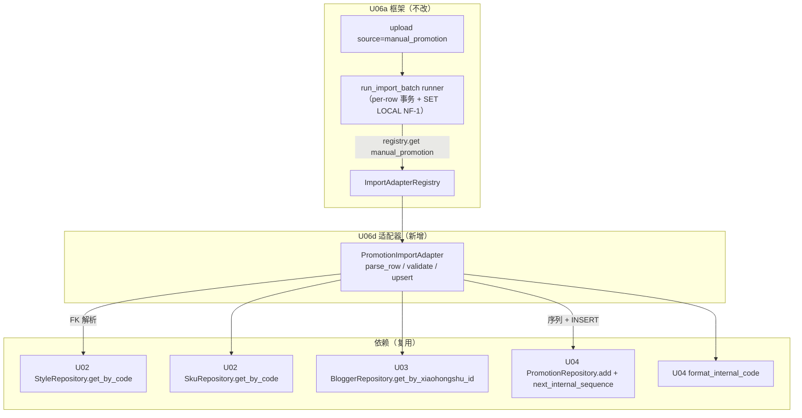
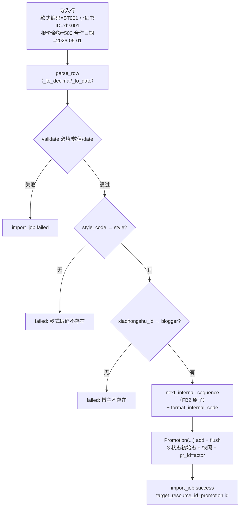

# U06d 领域实体（Domain Entities）

> 单元：U06d — 推广导入适配器
> 范围：PromotionImportAdapter（满足 U06a `ImportAdapter` 协议）+ manual_promotion 字段映射
> **无新表 / 无新 ORM 模型 / 无新 API / 无新 Celery 任务**
> 复用：U04（Promotion + PromotionRepository + next_internal_sequence + format_internal_code）+ U02（Style/Sku 查询）+ U03（Blogger 查询）+ U06a（框架）

---

## 1. 实体清单

U06d 不引入新持久化实体。新增**一个无状态适配器** + **一份字段映射数据**。

| # | 组件/数据 | 类型 | 持久化 | 说明 |
|---|---|---|---|---|
| 1 | `PromotionImportAdapter` | 适配器类（实现 U06a Protocol） | 否 | 导入行 → FK 解析 + internal_code 生成 + INSERT promotion |
| 2 | `manual_promotion` 默认映射 | 代码内置常量 | 否 | 中文表头 → promotion 字段 |
| 3 | `manual_promotion` 自定义映射 | U06a field_mapping 行 | 是（复用 U06a 表） | 租户级覆盖列名 |

**复用既有实体**（不改动）：U04 `Promotion` / `PromotionSequence`；U02 `Style`/`Sku`；U03 `Blogger`；U06a import_*。

> **无领域事件**：导入创建的 promotion 处于初始态（未发布/未召回/未核查），不触发 SettlementRequested 等事件（事件由 U04 状态机推进时触发）。

---

## 2. 组件关系图（Mermaid）



---

## 3. PromotionImportAdapter 契约

```python
# modules/importer/adapters/promotion.py
class PromotionImportAdapter:
    source: str = "manual_promotion"
    target_table: str = "promotion"

    def parse_row(self, row, mapping) -> dict:     # _to_decimal / _to_date / str
    def validate(self, parsed) -> list[str]:       # 必填 + 数值 + date（不查 FK）
    async def upsert(self, parsed, *, session, tenant_id, actor_id) -> tuple[UUID, bool]:
        # FK 解析（style/blogger 必需 + sku 可选）→ internal_code 生成 → INSERT promotion
        # 返回 (promotion.id, True)  # INSERT-only，is_inserted 恒 True

def register() -> None:
    ImportAdapterRegistry.register(PromotionImportAdapter())
```

### 3.1 与 U06b/c 的本质差异

| 维度 | U06b/c | U06d |
|---|---|---|
| 写入 | upsert_atomic（ON CONFLICT） | **INSERT-only**（add + flush） |
| 业务键 | 文件提供（sku_code/xhs_id） | **internal_code 系统生成**（序列号） |
| FK 解析 | 0-1 软关联 | **style + blogger 必需 + sku 可选** |
| is_inserted | upsert 路径 | 恒 True |

---

## 4. manual_promotion 默认字段映射

| source_col | target_field | required | type | 目标 |
|---|---|---|---|---|
| 款式编码 | style_code | ✅ | str | → style_id（FK） |
| SKU编码 | sku_code | — | str | → sku_id（可选 FK） |
| 小红书ID | xiaohongshu_id | ✅ | str | → blogger_id（FK） |
| 报价金额 | quote_amount | ✅ | decimal | Promotion.quote_amount（≥0） |
| 成本快照 | cost_snapshot | — | decimal | Promotion.cost_snapshot（≥0） |
| 平台 | platform | ✅ | str | 默认"小红书" |
| 合作日期 | cooperation_date | ✅ | date | internal_code 前缀 + 业务 |
| 计划发布日期 | scheduled_publish_date | — | date | |
| 笔记标题 | note_title | — | str | |
| 备注 | remark | — | str | |

> 系统生成/默认（不在映射）：internal_code（序列）/ style_code_snapshot / style_short_name_snapshot（从 style）/ pr_id（=actor_id）/ 3 状态（初始态）。

---

## 5. 一行 → Promotion（INSERT-only + FK 解析）



---

## 6. 类型转换规则

| type | 转换 | 空 |
|---|---|---|
| str | strip | "" → None |
| decimal | 去千分位 + Decimal（禁 float） | "" → None；非法/负数 → validate 失败 |
| date | `date.fromisoformat`（YYYY-MM-DD） | "" → None；非法 → validate 失败 |

- raw_data 保真存原始行
- mapping=None → 内置默认映射（§4）

---

## 7. 幂等语义与已知限制

| 场景 | 行为 |
|---|---|
| 同文件重复 upload | U06a hash 去重 → 409（框架层） |
| 同 batch retry only_failed | 仅重跑失败行；成功行已建 promotion 不再处理 |
| 同 batch retry（整文件，解析失败） | 解析失败时尚无行处理，无重复 |
| **两个不同文件含相同逻辑推广** | **创建重复 promotion**（已知限制；与 U04 重复检测为 warning 的语义一致；导入层不强约束）。V1 评估可选 dedup 键 |

---

## 8. 演化路线
- U06e：结算导入适配器（同协议）
- V1：已发布历史推广导入（actual_publish_date + 状态校验 + 可选 dedup 键）
