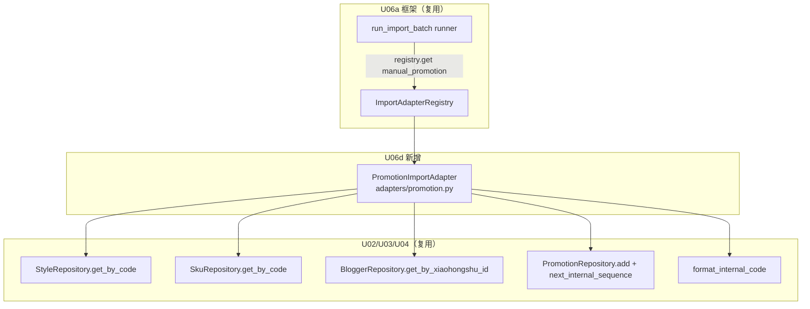

# U06d 逻辑组件（Logical Components）

> 单元：U06d — 推广导入适配器
> 范围：1 个新组件（PromotionImportAdapter）+ 复用 U02/U03/U04/U06a + 注册序列
> **无新表 / 无新端点 / 无新 Celery 任务 / 无 main.py·celery_app.py 改动**

---

## 1. 组件清单

### 1.1 新建（modules/importer/adapters/）

| 组件 | 文件 | 职责 |
|---|---|---|
| Promotion 适配器 | `adapters/promotion.py` | `PromotionImportAdapter`（parse_row/validate/upsert）+ `_DEFAULT_COLUMNS`(10) + `_to_date` + `_to_decimal` + `_get_tenant_code`(实例缓存) + `register()` |

> `adapters/__init__.py` 已由 U06b 创建。

### 1.2 复用（不改动）

| 组件 | 来源 | 用法 |
|---|---|---|
| ImportAdapter Protocol / Registry / runner / 8 端点 | U06a | 实现 + 注册 + 编排 |
| `StyleRepository.get_by_code` | U02 | style_code → style_id |
| `SkuRepository.get_by_code` | U02 | sku_code → sku_id（可选） |
| `BloggerRepository.get_by_xiaohongshu_id` | U03 | xiaohongshu_id → blogger_id |
| `PromotionRepository.add` / `next_internal_sequence` | U04 | INSERT + 原子序列 |
| `format_internal_code` | U04 domain | internal_code 格式化 |
| `Promotion` ORM / `Tenant` ORM | U04 / U01 | 目标表 / tenant_code |
| `register_import_adapters` | U06a main.py | 已含 adapters.promotion 路径 |

---

## 2. 依赖图（Mermaid）



---

## 3. 注册序列（复用 U06a，无新增）

```
[HTTP 进程] main.py lifespan: register_import_adapters()
  → import_module("app.modules.importer.adapters.promotion")
  → promotion.register() → ImportAdapterRegistry.register(PromotionImportAdapter())

[Celery worker] worker_process_init: register_import_adapters()（同上）
```

> main.py 已含 `app.modules.importer.adapters.promotion`（U06a 预置）。U06d 落地后双进程自动注册，**main.py / celery_app.py 不改**。

---

## 4. 数据流（端到端，INSERT-only + FK 解析）

```
upload(file, source=manual_promotion)  ── U06a ImportService
  → run_import_batch.delay  ── U06a runner
      → registry.get("manual_promotion") → PromotionImportAdapter
      → _parse_rows → 行迭代
      → 每行 per-row 事务（SET LOCAL，NF-1）:
           parse_row（_to_date/_to_decimal）→ validate（不查 FK）→ upsert:
             ├─ StyleRepository.get_by_code（未找到 raise → failed）
             ├─ BloggerRepository.get_by_xiaohongshu_id（未找到 raise → failed）
             ├─ SkuRepository.get_by_code（sku_code 非空时）
             ├─ _get_tenant_code（缓存）+ next_internal_sequence（FB2）+ format_internal_code
             └─ Promotion(...) add + flush → (id, True)
           → import_job.success(target_resource_id=promotion.id)
      → 汇总 → batch.completed/partial/failed
```

---

## 5. 测试组件

| 组件 | 文件 | 覆盖 |
|---|---|---|
| unit | `tests/unit/test_promotion_adapter.py` | parse_row（_to_date/_to_decimal/默认/自定义）+ validate（必填/数值/date 各分支） |
| integration | `tests/integration/test_import_promotion.py` | seed style+blogger → upload 样本 CSV → _run_import_batch → promotion 入库 + internal_code 生成 + 序号连续 + 缺 style/blogger failed + sku 可选 + partial + tenant_id |

---

## 6. 一致性校验

| 校验 | 结果 |
|---|---|
| 唯一新组件 = adapters/promotion.py | ✅ §1.1 |
| 复用 U02/U03/U04 Repository + U06a 框架 | ✅ §1.2 |
| 注册复用 U06a（main.py 不改） | ✅ §3 |
| 无新表/端点/Celery 任务 | ✅ 全文 |
| 数据流经 runner per-row 事务（NF-1）+ FK 解析 | ✅ §4 |
