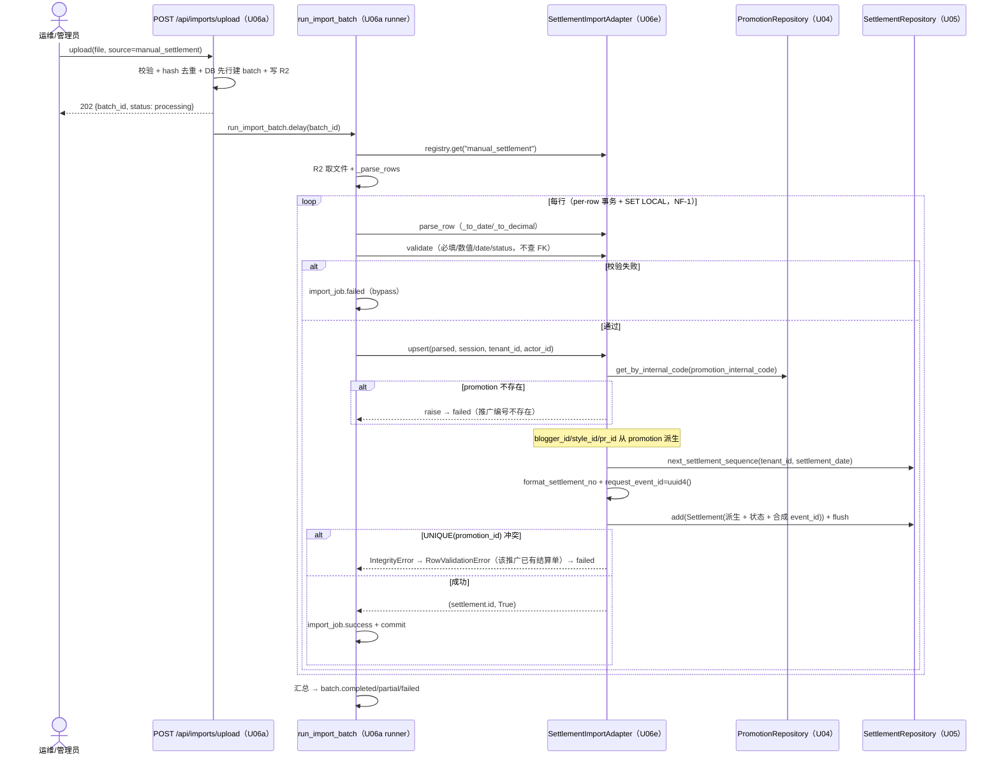
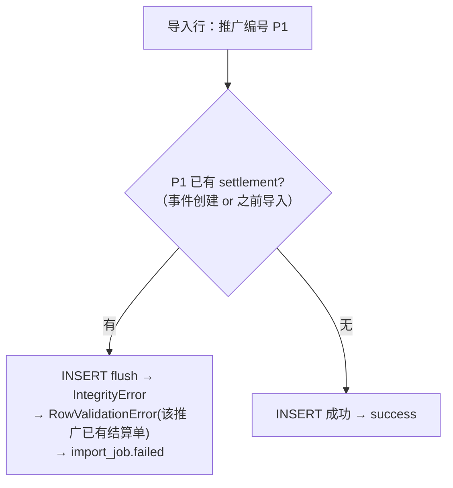
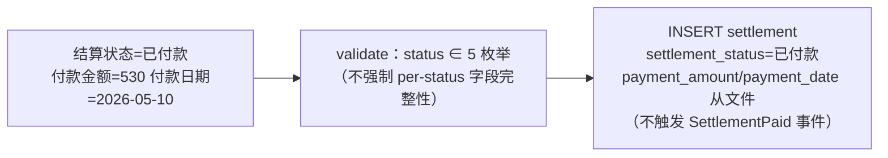

# U06e 业务逻辑模型（Business Logic Model）

> 单元：U06e — 结算导入适配器（历史结算数据迁移）
> 范围：5 UC（注册 / 端到端历史迁移 / 重复 promotion 失败 / 自定义映射 / 状态导入）
> 聚焦 SettlementImportAdapter 在 runner per-row 事务内的 INSERT-only + promotion 派生编排

---

## UC-1 适配器注册（启动期）

复用 U06a register_import_adapters：
```
register_import_adapters() → import_module("app.modules.importer.adapters.settlement")
  → settlement.register() → ImportAdapterRegistry.register(SettlementImportAdapter())
```
> main.py 已预置 `adapters.settlement` 路径；落地后双进程自动注册（NF-4）。

---

## UC-2 端到端历史迁移（主流程，INSERT-only + promotion 派生）



> **不触发任何事件**（与 U05 service mark_paid 发 SettlementPaid 不同）。

---

## UC-3 重复 promotion 失败（UNIQUE 一对一，FB3）



> FB3：财务记录永久不可替换 → 导入绝不覆盖既有 settlement（无论来源）。

---

## UC-4 自定义字段映射

运维遗留文件列名不同 → U06a `POST /api/imports/field-mappings`（source=manual_settlement）建 active 版本 → batch.mapping_version → runner 加载 → parse_row 按自定义列名。

---

## UC-5 历史状态导入



> 历史数据可信：导入终态结算（如已付款）允许，payment 字段从文件可选导入；区别 live 状态机的逐步推进 + 强校验。

---

## 用例汇总

| UC | 名称 | 复用 | U06e 新增 |
|---|---|---|---|
| UC-1 | 注册 | U06a register | register() |
| UC-2 | 端到端历史迁移 | U06a runner + U04/U05 repo | parse_row/validate/upsert（promotion 派生 + settlement_no + 合成 event_id） |
| UC-3 | 重复 promotion 失败 | U06a per-row 隔离 | UNIQUE(promotion_id) IntegrityError catch |
| UC-4 | 自定义映射 | U06a field-mapping | manual_settlement 列 |
| UC-5 | 历史状态导入 | — | settlement_status 枚举校验 + 不触发事件 |

---

## 端到端验收样本（测试 fixture 设计）

前置：测试 seed promotion(P1, internal_code=XY...0001) + 关联 blogger/style；P2 已有 settlement（模拟事件创建）。

| 推广编号 | 结算日期 | 金额 | 总金额 | 结算状态 | 预期 |
|---|---|---|---|---|---|
| XY...0001 | 2026-06-01 | 500 | 530 | 待核查 | 建 settlement（success，settlement_no 生成，派生 blogger/style/pr） |
| XY...0002（已有 settlement） | 2026-06-01 | 500 | 500 | 已付款 | UNIQUE(promotion_id) 冲突 → failed |
| XY...9999（不存在） | 2026-06-01 | 100 | 100 | 待核查 | 推广编号不存在 → failed |

预期 batch：total_rows=3, imported=1, failed=2, status=partial；成功 settlement 的 blogger_id/style_id == promotion 的。
