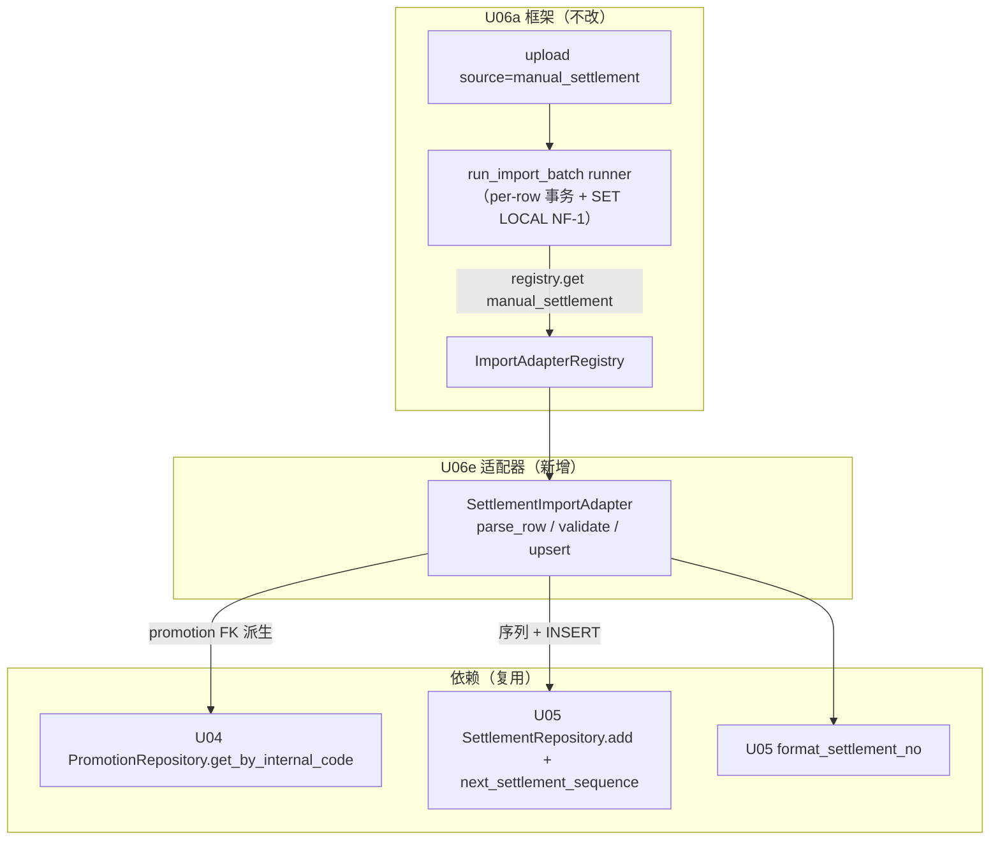

# U06e 领域实体（Domain Entities）

> 单元：U06e — 结算导入适配器（导入支线最后一个 Adapter）
> 范围：SettlementImportAdapter（满足 U06a `ImportAdapter` 协议）+ manual_settlement 字段映射
> **无新表 / 无新 ORM 模型 / 无新 API / 无新 Celery 任务**
> 复用：U05（Settlement + SettlementRepository + next_settlement_sequence + format_settlement_no）+ U04（Promotion 查询）+ U06a（框架）
> **语义：历史结算数据迁移（Legacy Migration），非日常运营流程**

---

## 0. 语义定位（U06e 特殊性）

U06e 是**运维迁移工具**：新租户上线时把遗留系统的已有结算批量导入。日常结算仍由 U04 review approve → SettlementRequested 事件 → finance listener 创建（U06e 不参与日常流程）。

| settlement 特性 | 对导入的约束 |
|---|---|
| 事件创建（正常流程） | 导入是非正常流程，**不触发事件** |
| FB3 永久不可替换（无 is_active/无 delete） | 导入只 **INSERT**，绝不 update 既有 |
| UNIQUE(promotion_id)（一对一） | 同 promotion 已有 settlement → 行失败 |
| UNIQUE(request_event_id) | 导入生成**合成 request_event_id（uuid4）** |

---

## 1. 实体清单

U06e 不引入新持久化实体。新增**一个无状态适配器** + **一份字段映射数据**。

| # | 组件/数据 | 类型 | 持久化 | 说明 |
|---|---|---|---|---|
| 1 | `SettlementImportAdapter` | 适配器类 | 否 | 历史结算行 → promotion FK 派生 + settlement_no 生成 + INSERT |
| 2 | `manual_settlement` 默认映射 | 代码内置常量 | 否 | 中文表头 → settlement 字段 |
| 3 | `manual_settlement` 自定义映射 | U06a field_mapping 行 | 是 | 租户级覆盖 |

**复用既有实体**（不改动）：U05 `Settlement`/`SettlementSequence`；U04 `Promotion`；U06a import_*。

---

## 2. 组件关系图（Mermaid）



---

## 3. SettlementImportAdapter 契约

```python
# modules/importer/adapters/settlement.py
class SettlementImportAdapter:
    source: str = "manual_settlement"
    target_table: str = "settlement"

    def parse_row(self, row, mapping) -> dict:     # _to_date / _to_decimal / str
    def validate(self, parsed) -> list[str]:       # 必填 + 数值 + date + status 枚举
    async def upsert(self, parsed, *, session, tenant_id, actor_id) -> tuple[UUID, bool]:
        # promotion FK 派生 → settlement_no + 合成 request_event_id → INSERT
        # UNIQUE(promotion_id) 冲突 → RowValidationError；返回 (settlement.id, True)

def register() -> None:
    ImportAdapterRegistry.register(SettlementImportAdapter())
```

### 3.1 与 U06d 的关键差异
- promotion FK：**1 个**（internal_code），blogger_id/style_id/pr_id **从 promotion 派生**（不让文件提供，保证一致性）
- **合成 request_event_id = uuid4()**（导入无真实事件）
- **UNIQUE(promotion_id) 一对一**：重复 promotion → 失败（FB3 不覆盖）
- settlement_status 从文件导入（∈ 5 枚举），**不触发事件**

---

## 4. manual_settlement 默认字段映射

| source_col | target_field | required | type | 目标 |
|---|---|---|---|---|
| 推广编号 | promotion_internal_code | ✅ | str | → promotion（派生 blogger/style/pr） |
| 结算日期 | settlement_date | ✅ | date | settlement_no 日期段 + date_key |
| 金额 | amount | ✅ | decimal | Settlement.amount（≥0） |
| 总金额 | total_amount | ✅ | decimal | Settlement.total_amount（≥0，历史值不重算） |
| 付款金额 | payment_amount | — | decimal | ≥0 |
| 付款日期 | payment_date | — | date | |
| 结算状态 | settlement_status | — | str | ∈ 5 枚举，默认待核查 |
| 笔记标题 | note_title | — | str | |
| 备注 | remark | — | str | |

> 系统生成/派生：settlement_no（序列）/ request_event_id（uuid4 合成）/ blogger_id·style_id·pr_id（从 promotion）。

---

## 5. 一行 → Settlement（INSERT-only + promotion 派生）

```mermaid
flowchart TD
    ROW["历史结算行<br/>推广编号=XY2606010001<br/>金额=500 总金额=530<br/>结算状态=已付款"]
    ROW --> PARSE["parse_row（_to_date/_to_decimal）"]
    PARSE --> VAL{"validate 必填/数值/date/status 枚举"}
    VAL -->|失败| FAIL["import_job.failed"]
    VAL -->|通过| FKP{"internal_code → promotion?"}
    FKP -->|无| FAILP["failed: 推广编号不存在"]
    FKP -->|有| SEQ["next_settlement_sequence + format_settlement_no<br/>+ request_event_id=uuid4()"]
    SEQ --> INS["Settlement(... 派生 blogger/style/pr + 状态) add + flush"]
    INS -->|UNIQUE(promotion_id) 冲突| FAILU["failed: 该推广已有结算单"]
    INS -->|成功| OK["import_job.success<br/>target_resource_id=settlement.id"]
```

---

## 6. 类型转换规则

| type | 转换 | 空 |
|---|---|---|
| str | strip | "" → None |
| decimal | 去千分位 + Decimal（禁 float） | "" → None；非法/负数 → validate 失败 |
| date | date.fromisoformat（YYYY-MM-DD） | "" → None；非法 → validate 失败 |

- settlement_status 校验 ∈ {待核查, 待付款, 待财务付款, 已付款, 已驳回}（空 → 默认待核查）
- raw_data 保真；mapping=None → 内置默认映射（§4）

---

## 7. 演化路线
- V1：历史已付款记录的付款截图迁移（payment_proof_attachment_id）
- V1：导入 dry-run 预校验（先报全部 FK/冲突再决定是否提交）
