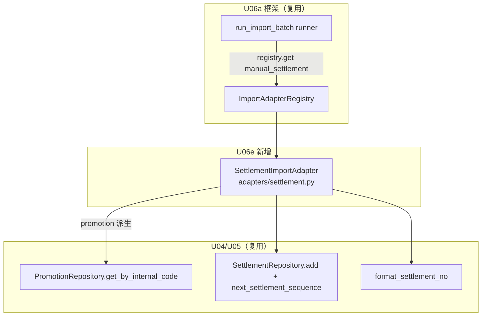

# U06e 逻辑组件（Logical Components）

> 单元：U06e — 结算导入适配器
> 范围：1 个新组件（SettlementImportAdapter）+ 复用 U04/U05/U06a + 注册序列
> **无新表 / 无新端点 / 无新 Celery 任务 / 无 main.py·celery_app.py 改动**

---

## 1. 组件清单

### 1.1 新建（modules/importer/adapters/）

| 组件 | 文件 | 职责 |
|---|---|---|
| Settlement 适配器 | `adapters/settlement.py` | `SettlementImportAdapter`（parse_row/validate/upsert）+ `_DEFAULT_COLUMNS`(9) + `_to_date` + `_to_decimal` + `_get_tenant_code`(缓存) + `register()` |

> `adapters/__init__.py` 已由 U06b 创建。

### 1.2 复用（不改动）

| 组件 | 来源 | 用法 |
|---|---|---|
| ImportAdapter Protocol / Registry / runner / 8 端点 | U06a | 实现 + 注册 + 编排 |
| `PromotionRepository.get_by_internal_code` | U04 | promotion 派生 blogger/style/pr |
| `SettlementRepository.add` / `next_settlement_sequence` | U05 | INSERT + 原子序列 |
| `format_settlement_no` | U05 domain | settlement_no 格式化 |
| `SettlementStatus`（5 枚举） | U05 enums | status 校验 |
| `Settlement` ORM / `Tenant` ORM | U05 / U01 | 目标表 / tenant_code |
| `RowValidationError` | U06a exceptions | FK 缺失 / UNIQUE 冲突 |
| `register_import_adapters` | U06a main.py | 已含 adapters.settlement 路径 |

---

## 2. 依赖图（Mermaid）



---

## 3. 注册序列（复用 U06a，无新增）

```
[HTTP 进程] main.py lifespan: register_import_adapters()
  → import_module("app.modules.importer.adapters.settlement")
  → settlement.register() → ImportAdapterRegistry.register(SettlementImportAdapter())

[Celery worker] worker_process_init: register_import_adapters()（同上）
```

> main.py 已含 `app.modules.importer.adapters.settlement`（U06a 预置）。U06e 落地后双进程自动注册，**main.py / celery_app.py 不改**。

---

## 4. 数据流（端到端，历史迁移 INSERT-only）

```
upload(file, source=manual_settlement)  ── U06a ImportService
  → run_import_batch.delay  ── U06a runner
      → registry.get("manual_settlement") → SettlementImportAdapter
      → _parse_rows → 行迭代
      → 每行 per-row 事务（SET LOCAL，NF-1）:
           parse_row（_to_date/_to_decimal）→ validate（status 枚举，不查 FK）→ upsert:
             ├─ PromotionRepository.get_by_internal_code（未找到 raise → failed）
             ├─ blogger/style/pr 从 promotion 派生
             ├─ _get_tenant_code + next_settlement_sequence + format_settlement_no + uuid4()
             └─ Settlement(...) add + flush
                  └─ UNIQUE(promotion_id) 冲突 → IntegrityError → RowValidationError → failed
           → import_job.success(target_resource_id=settlement.id)（不触发事件）
      → 汇总 → batch.completed/partial/failed
```

---

## 5. 测试组件

| 组件 | 文件 | 覆盖 |
|---|---|---|
| unit | `tests/unit/test_settlement_adapter.py` | parse_row（_to_date/_to_decimal/默认/自定义）+ validate（必填/数值/date/status 枚举各分支） |
| integration | `tests/integration/test_import_settlement.py` | seed promotion + 已有 settlement → upload 样本 CSV → _run_import_batch → settlement 入库 + settlement_no + 派生 blogger/style + 重复 promotion failed + 缺 promotion failed + 不触发事件 + partial + tenant_id |

---

## 6. 一致性校验

| 校验 | 结果 |
|---|---|
| 唯一新组件 = adapters/settlement.py | ✅ §1.1 |
| 复用 U04/U05 Repository + U06a 框架 | ✅ §1.2 |
| 注册复用 U06a（main.py 不改） | ✅ §3 |
| 无新表/端点/Celery 任务 | ✅ 全文 |
| 数据流经 runner per-row 事务（NF-1）+ promotion 派生 + 不触发事件 | ✅ §4 |
