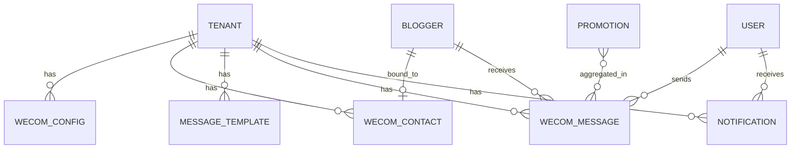

# U07 领域实体（企微集成基础）

> 单元：U07 — 企微集成基础
> 覆盖故事：EP08-S02 ~ S08
> 依赖：U04（promotion + urge_calculator）；复用 U01（TenantScopedModel / audit / crypto / RLS / Celery）+ U03（blogger）

---

## 1. 实体总览

| 实体 | 表名 | 说明 | 新建 |
|---|---|---|---|
| WecomConfig | `wecom_config` | 企微自建应用配置（单租户单条，secret 密文） | ✅ |
| WecomContact | `wecom_contact` | 博主 ↔ 企微外部联系人绑定 | ✅ |
| MessageTemplate | `message_template` | 催发消息模板（按类型） | ✅ |
| WecomMessage | `wecom_message` | 企微群发消息记录（6 态状态机） | ✅ |
| Notification | `notification` | 站内通知（MVP 首个消费者 = 频控降级） | ✅ |

均继承 `TenantScopedModel`（U01）：自动 `id`(UUID PK) + `tenant_id`(FK + ORM 钩子) + `created_at`/`updated_at`，并启用 RLS。

---

## 2. WecomConfig（企微自建应用配置）

| 字段 | 类型 | 约束 | 说明 |
|---|---|---|---|
| corp_id | String(64) | NOT NULL | 企业 ID |
| agent_id | String(32) | NOT NULL | 自建应用 AgentId |
| secret_ciphertext | LargeBinary | NOT NULL | 应用 secret 密文（AES-256-GCM，绝不回显） |
| callback_token | String(64) | NULL | 回调签名校验 token |
| callback_aes_key | String(64) | NULL | 回调消息加解密 AESKey（EncodingAESKey） |
| default_sender_userid | String(64) | NULL | 群发助手默认发送人企微 userid |
| is_active | Boolean | NOT NULL default true | 是否启用 |

约束：`UNIQUE(tenant_id)`（单租户单条）。

**安全**：`secret_ciphertext` 经 `core/security/crypto.encrypt_credential(tenant_id, plaintext)` 加密；解密经 `decrypt_credential(..., purpose="wecom_send")` 并写 `@audit("wecom.secret.decrypt")`。Schema 响应永不含明文 secret（仅返回 `secret_configured: bool`）。

---

## 3. WecomContact（博主外部联系人绑定）

| 字段 | 类型 | 约束 | 说明 |
|---|---|---|---|
| blogger_id | UUID | FK blogger.id ON DELETE CASCADE, NOT NULL | 博主 |
| external_userid | String(128) | NOT NULL | 企微外部联系人 ID |
| matched_wechat | String(64) | NULL | 绑定时匹配用的微信号（快照） |
| bound_by | UUID | FK user.id ON DELETE SET NULL, NULL | 绑定操作人 |
| bound_at | DateTime(tz) | NOT NULL | 绑定时间 |

约束：`UNIQUE(tenant_id, blogger_id)`（一博主一绑定，可重绑覆盖）；`INDEX(tenant_id, external_userid)`。

---

## 4. MessageTemplate（催发消息模板）

| 字段 | 类型 | 约束 | 说明 |
|---|---|---|---|
| template_type | String(16) | NOT NULL | urge / urge_important |
| content | Text | NOT NULL | 模板文本（含变量占位） |
| updated_by | UUID | FK user.id ON DELETE SET NULL, NULL | 最近编辑人 |

约束：`UNIQUE(tenant_id, template_type)`。

**变量白名单**：`{博主昵称}` `{商品简称}` `{预定发布日期}` `{剩余天数}`。保存时正则提取 `{...}`，超出白名单 → 422。超时（超时态）复用 `urge_important` 模板。

---

## 5. WecomMessage（企微群发消息记录）

| 字段 | 类型 | 约束 | 说明 |
|---|---|---|---|
| blogger_id | UUID | FK blogger.id ON DELETE RESTRICT, NOT NULL | 接收博主 |
| pr_id | UUID | FK user.id ON DELETE SET NULL, NULL | 发起 PR（频控维度） |
| external_userid | String(128) | NULL | 接收人 external_userid 快照 |
| template_type | String(16) | NOT NULL | urge / urge_important |
| rendered_content | Text | NOT NULL | 渲染后文案 |
| promotion_ids | JSONB | NOT NULL default '[]' | 聚合的 promotion id 列表（溯源） |
| status | String(16) | NOT NULL default 'pending' | 6 态状态机 |
| wecom_msgid | String(128) | NULL | 企微返回 msgid |
| error_detail | Text | NULL | 失败/降级原因 |
| sent_at | DateTime(tz) | NULL | 发送完成时间 |

约束：`INDEX(tenant_id, blogger_id, created_at)`（博主当天频控统计）；`INDEX(tenant_id, pr_id, created_at)`（PR 当天频控统计）；`INDEX(tenant_id, status)`。无 is_active（消息记录永久留痕）。

### 5.1 状态机（6 态）

```
pending ──发送成功──→ created ──回调确认──→ sent
   │                     │
   │                     ├──回调拒绝──→ rejected
   │                     └──回调失败──→ failed
   ├──频控命中──→ rate_limited（终态，已写 notification）
   └──API 异常──→ failed
```

| 状态 | 含义 |
|---|---|
| pending | 扫描已写入，待执行群发 |
| created | 已调 add_msg_template 创建群发，待 PR 企微端确认 |
| sent | 回调确认已发送 |
| rejected | PR 在企微端拒绝 |
| rate_limited | 频控降级（已转站内通知） |
| failed | API 调用或发送失败 |

---

## 6. Notification（站内通知）

| 字段 | 类型 | 约束 | 说明 |
|---|---|---|---|
| user_id | UUID | FK user.id ON DELETE CASCADE, NOT NULL | 接收用户 |
| type | String(32) | NOT NULL | urge_manual 等通知类型 |
| content | Text | NOT NULL | 通知内容 |
| link | String(255) | NULL | 跳转链接（可选） |
| is_read | Boolean | NOT NULL default false | 已读标记 |

约束：`INDEX(tenant_id, user_id, is_read, created_at)`。

---

## 7. ER 图



---

## 8. 复用与契约

| 复用 | 来源 | 用途 |
|---|---|---|
| `urge_calculator.URGE_STATUS_SQL_EXPR` + `calculate_urge_status` + `get_today` | U04 | 扫描筛选催发候选（SQL 表达式） |
| `crypto.encrypt_credential` / `decrypt_credential` | U01（U07 落地实现） | secret 加解密 |
| `core/audit` | U01 | secret 解密 / 回调可疑请求审计 |
| `blogger` 表 + `wechat` 字段 | U03 | 绑定匹配源 |
| `promotion`（pr_id / blogger_id / scheduled_publish_date / style_short_name_snapshot） | U04 | 扫描聚合 + 模板渲染 |
| Celery Beat / Worker | U01 | scan_and_dispatch_urge + execute_wecom_message |

### 演化（后续单元）
- U15：MessageTemplate 增 publish_notify 类型 + 群机器人 webhook + 异常预警扫描。
- U12：crypto 密钥轮换 + 采集凭据 CRUD（复用 U07 落地的 AES-256-GCM）。
