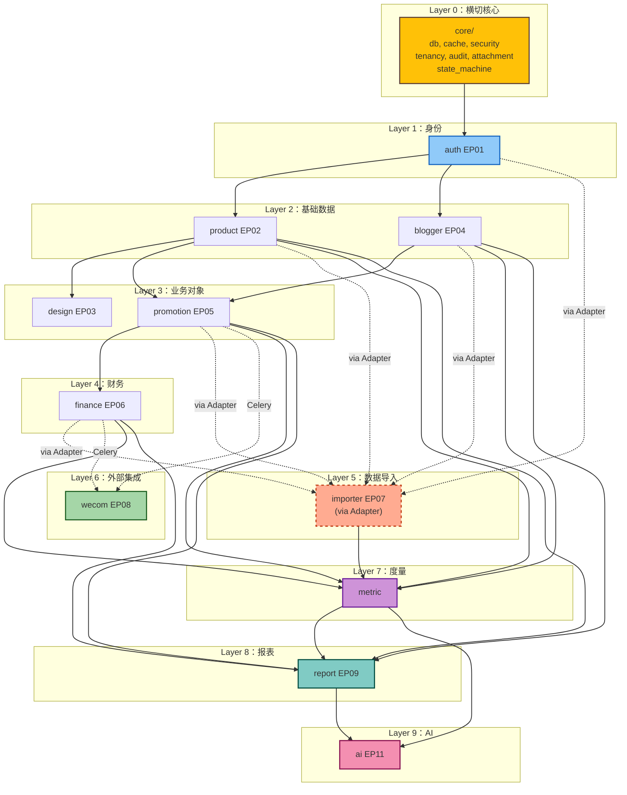

# 组件依赖关系（Component Dependency）

> 标注通信模式（同步函数 / Celery 任务 / DB 事件 / HTTP API），并验证无循环依赖。

## 1. 依赖矩阵（行依赖列）

| ↓依赖 / 被依赖→ | core | auth | product | design | blogger | promotion | finance | importer | wecom | report | metric | ai |
|---|---|---|---|---|---|---|---|---|---|---|---|---|
| **auth** (EP01) | ✅ | — | | | | | | | | | | |
| **product** (EP02) | ✅ | ✅ | — | | | | | | | | | |
| **design** (EP03) | ✅ | ✅ | ✅ | — | | | | | | | | |
| **blogger** (EP04) | ✅ | ✅ | | | — | | | | | | ✅ | |
| **promotion** (EP05) | ✅ | ✅ | ✅ | | ✅ | — | | | (T) | | ✅ | |
| **finance** (EP06) | ✅ | ✅ | ✅ | | | ✅ | — | | | | | |
| **importer** (EP07) | ✅ | ✅ | (R) | | (R) | (R) | (R) | — | | | | |
| **wecom** (EP08) | ✅ | ✅ | ✅ | | ✅ | ✅ | | | — | | | |
| **report** (EP09) | ✅ | ✅ | ✅ | | ✅ | ✅ | ✅ | ✅ | | — | ✅ | |
| **metric** | ✅ | ✅ | ✅ | | ✅ | ✅ | ✅ | ✅ | | | — | |
| **ai** (EP11) | ✅ | ✅ | | | | | | | | ✅ | ✅ | — |

> 标记说明：
> - ✅ 直接同步函数调用
> - (T) Celery 任务调用（异步通知）
> - (R) 通过 ImportAdapter 反向调用（importer 调用 product/blogger/promotion/finance 的 Repository upsert，依赖反转通过 Adapter Protocol 解耦）

### 关键说明

- **product → metric**：编辑 cost_price 时无需调用 metric（指标实时算）
- **promotion → wecom (T)**：promotion 创建/发布时**通过 Celery 任务**异步触发企微通知，不直接同步调用，避免 promotion 模块强耦合 wecom
- **importer → 业务模块**：importer 通过 `ImportAdapterRegistry` 注册的 Adapter 协议反向调用业务模块的 Repository upsert，依赖**注入**而非直接 import
- **report → 几乎所有模块**：report 是聚合层，依赖被允许；但绝不被反向依赖
- **metric**：纯计算层，被多个 Service 依赖，本身只依赖 core 和业务 ORM 模型

---

## 2. 循环依赖验证

按拓扑序排列：

```
Layer 0: core
Layer 1: auth
Layer 2: product, blogger
Layer 3: design (← product), promotion (← product, blogger)
Layer 4: finance (← promotion)
Layer 5: importer (反向通过 Adapter 调用 L1-L4)
Layer 6: wecom (← promotion + finance via Celery)
Layer 7: metric (被 L2-L4 反向调用，但不调回上层)
Layer 8: report (聚合 L2-L7)
Layer 9: ai (聚合 report + metric)
```

✅ **无循环依赖**。validate by topological sort。

---

## 3. 模块依赖图（Mermaid）



### 文本备份（Mermaid 不可用时）

```
core
 └─→ auth
      ├─→ product ────┬─→ design
      │               └─→ promotion ─┬─→ finance ─┐
      │                              │            │
      └─→ blogger ─────────→─────────┘            │
                                                  ↓
              promotion / finance ⇢ wecom (Celery)
              promotion / finance ⇢ metric ⇢ report ⇢ ai
              (importer 通过 Adapter 反向调用 product/blogger/promotion/finance)
```

---

## 4. 通信模式归纳

| 通信类型 | 路径 | 模式 |
|---|---|---|
| **同步函数调用** | 同 Layer 或上→下 | Python 调用 |
| **Celery 异步** | promotion/finance → wecom | `task.delay(...)` |
| **Adapter 反向** | importer ← business modules | Protocol 注入 |
| **HTTP API** | 主系统 ↔ 采集 Worker | REST + JWT |
| **HTTPS 外部** | wecom → 企微 API、ai → DeepSeek | HTTPS |
| **DB 事件钩子** | core/audit → 业务表 | SQLAlchemy events |

---

## 5. 数据流：推广全生命周期（Journey J2 + J4）

```
[PR 创建推广] (HTTP)
    └→ promotion.api → promotion.service.create()
                        ├→ product.repository.get_by_code()      [L2 ← L3]
                        ├→ blogger.repository.get()               [L2 ← L3]
                        └→ promotion.repository.create()

[Celery Beat 09:00]
    └→ wecom_tasks.scan_and_dispatch_urge()
        └→ promotion.repository.find_urge_candidates()           [L3 ← L6 via task]
        └→ wecom.repository.create_message()

[Celery Worker]
    └→ wecom_tasks.execute_wecom_message()
        └→ wecom.service.check_rate_limit()
        └→ WecomClient.send_external_msg_template() ⇢ 企微 API   [HTTPS]

[PR 填发布链接] (HTTP)
    └→ promotion.api → promotion.service.publish()
                        └→ Celery: notify_control_evaluation()    [L3 → L6]

[PR 主管审核] (HTTP)
    └→ promotion.api → promotion.service.review("approve")
                        └→ finance.service.create_from_promotion() [L3 → L4]
                              └→ NotificationService.notify(财务)

[财务付款上传截图] (HTTP)
    └→ finance.api → finance.service.upload_payment_proof()
                        └→ AttachmentService.upload(private bucket) [→ L0]
                        └→ AuditService.log()                       [→ L0]
```

---

## 6. 数据流：采集到入库（Journey J3）

```
[Celery Beat 02:00]
    └→ crawler_tasks.schedule_daily_tasks()
        ├→ credential.repository.list_active()
        └→ crawler_task.repository.create(pending)

[采集 Worker 端] HTTP POST /api/crawler/tasks/poll
    ├→ crawler_task.service.poll_next_task()
    │   ├→ SELECT FOR UPDATE SKIP LOCKED 拉一个 pending
    │   ├→ credential.service.decrypt_for_purpose()
    │   │   ├→ core/security/crypto.decrypt_credential()           [→ L0]
    │   │   └→ AuditService.log("decrypt", ...)                    [→ L0]
    │   └→ 返回 (task_id, account, password) (临时使用)

[采集 Worker 抓取] (HTTPS to 千牛/万相台/灰豚)
    └→ 浏览器自动化 → 导出 CSV/Excel

[采集 Worker 回传] HTTP POST /api/crawler/tasks/{id}/result
    ├→ crawler_task.service.report_result(success, attachment)
    │   ├→ AttachmentService.upload(private bucket)               [→ L0]
    │   └→ ImportService.upload(file, source)                     [L5]
    │       └→ Celery: run_import_batch.delay(batch_id)

[Celery Worker]
    └→ run_import_batch(batch_id)
        ├→ adapter = ImportAdapterRegistry.get(source)
        ├→ for row in csv:
        │   ├→ adapter.parse_row()
        │   ├→ adapter.validate()
        │   └→ adapter.upsert() → 业务表                          [L5 → L1-L4]
        └→ batch.status = "completed"
```

---

## 7. 一致性校验

| 校验 | 结果 |
|---|---|
| 无循环依赖（拓扑可排序） | ✅ |
| importer 不在依赖图主链中（通过 Adapter 反转） | ✅ |
| 所有跨模块同步调用走 Service 层（不直接调 Repository） | ✅ |
| 所有外部调用（企微/DeepSeek/采集 Worker）走 Client 层封装 | ✅ |
| 横切组件（core/）被全模块依赖，但不依赖任何业务模块 | ✅ |
| metric 是纯计算层，无 side-effect（不写 DB） | ✅ |
| audit_log 仅 append，且写入路径有装饰器 + ORM 钩子双重保证 | ✅ |
| 多租户隔离在 db.py / tenancy.py 集中实现，业务模块零代码 | ✅ |

---

## 8. 与单元（U01-U18）的对照

| 单元 | 涉及组件 / 横切 | 通信关键点 |
|---|---|---|
| U01 | core/* + auth | 多租户中间件首次落地 |
| U02 | product + core/attachment | 同步 |
| U03 | blogger | 独立 |
| U04 | promotion + product + blogger + core/state_machine | 同步 + 实时计算 |
| U05 | finance ← promotion + core/state_machine + core/attachment | 跨模块编排 |
| U06a | importer + core/attachment | Celery + Adapter 注册 |
| U06b-e | importer Adapters → product/blogger/promotion/finance Repository | Adapter 反向 |
| U07 | wecom + core/cache | Celery + 企微 HTTP |
| U08 | report.publish_progress + metric.publish_progress | 同步聚合 |
| U09 | core/security/permissions（字段级） | Pydantic 动态 Schema |
| U10a | design + core/state_machine + core/attachment | 同步状态机 + 通知 |
| U10b | product.PlatformProductService | 同步 |
| U11 | blogger + metric.blogger_quality | Celery 重算 |
| U12 | importer.credential + core/security/crypto + core/audit | 加密 + 审计 |
| U13 | importer.crawler_task + 平台 Adapters | HTTP poll + Celery + Adapter |
| U14 | report + metric（多个子模块） | 同步聚合 + Celery 预聚合 |
| U15 | wecom（异常预警） | Celery + 监控 |
| U16 | finance.OrderAdjustment + finance.Balance | 同步 |
| U17 | product.Bundle + report.Export | 同步 |
| U18 | ai + report + metric | HTTPS + Celery |
