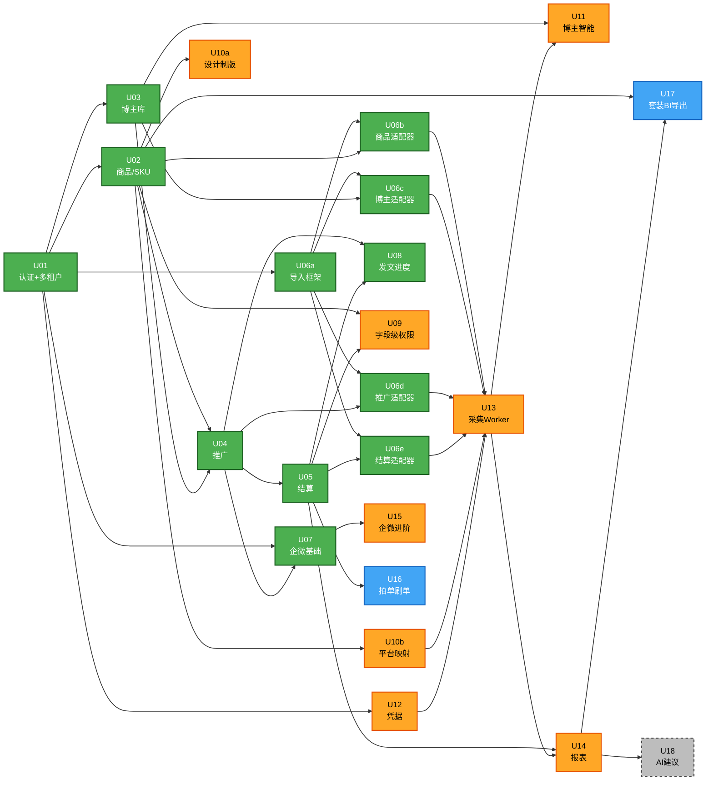

# 工作单元依赖（Unit of Work Dependency）

## 1. 依赖矩阵

> 行 = 单元；列 = 它依赖的单元；✅ = 直接依赖。同 Layer 内单元相互独立。

| ↓ 依赖 ↓ | U01 | U02 | U03 | U04 | U05 | U06a | U06b | U06c | U06d | U06e | U07 | U08 | U09 | U10a | U10b | U11 | U12 | U13 | U14 | U15 | U16 | U17 | U18 |
|---|---|---|---|---|---|---|---|---|---|---|---|---|---|---|---|---|---|---|---|---|---|---|---|
| U01 | — | | | | | | | | | | | | | | | | | | | | | | |
| U02 | ✅ | — | | | | | | | | | | | | | | | | | | | | | |
| U03 | ✅ | | — | | | | | | | | | | | | | | | | | | | | |
| U04 | ✅ | ✅ | ✅ | — | | | | | | | | | | | | | | | | | | | |
| U05 | ✅ | | | ✅ | — | | | | | | | | | | | | | | | | | | |
| U06a | ✅ | | | | | — | | | | | | | | | | | | | | | | | |
| U06b | ✅ | ✅ | | | | ✅ | — | | | | | | | | | | | | | | | | |
| U06c | ✅ | | ✅ | | | ✅ | | — | | | | | | | | | | | | | | | |
| U06d | ✅ | | | ✅ | | ✅ | | | — | | | | | | | | | | | | | | |
| U06e | ✅ | | | | ✅ | ✅ | | | | — | | | | | | | | | | | | | |
| U07 | ✅ | | | ✅ | | | | | | | — | | | | | | | | | | | | |
| U08 | ✅ | | | ✅ | ✅ | | | | | | | — | | | | | | | | | | | |
| U09 | ✅ | ✅ | | | ✅ | | | | | | | | — | | | | | | | | | | |
| U10a | ✅ | ✅ | | | | | | | | | | | | — | | | | | | | | | |
| U10b | ✅ | ✅ | | | | | | | | | | | | | — | | | | | | | | |
| U11 | ✅ | | ✅ | | | | | | | | | | | | | — | | ✅ | | | | | |
| U12 | ✅ | | | | | | | | | | | | | | | | — | | | | | | |
| U13 | ✅ | | | | | ✅ | ✅ | ✅ | ✅ | ✅ | | | | | ✅ | | ✅ | — | | | | | |
| U14 | ✅ | | | | ✅ | | | | | | | | | | | | | ✅ | — | | | | |
| U15 | ✅ | | | | | | | | | | ✅ | | | | | | | | | — | | | |
| U16 | ✅ | | | | ✅ | | | | | | | | | | | | | | | | — | | |
| U17 | ✅ | ✅ | | | | | | | | | | | | | | | | | ✅ | | | — | |
| U18 | ✅ | | | | | | | | | | | | | | | | | | ✅ | | | | — |

> U01 是所有单元的根依赖（认证 + 多租户基础），矩阵中 U01 列省略部分单元的勾以保持可读性，但**实际所有单元都依赖 U01**。

---

## 2. 拓扑分层

| Layer | sub-units | 阶段 | 说明 |
|---|---|---|---|
| L0 | U01 | MVP | 根依赖 |
| L1 | U02, U03 | MVP | 基础数据 |
| L2 | U04, U06a | MVP | 推广合作 + 导入框架 |
| L3 | U05, U06b, U06c, U06d, U06e, U07, U08 | MVP | 财务、各导入适配器、企微基础、发文看板 |
| L4 | U09, U10a, U10b, U12 | V1 | 字段级权限、设计制版、平台映射、凭据 |
| L5 | U13, U15 | V1 | 自动采集 Worker、企微进阶 |
| L6 | U11, U14 | V1 | 博主智能（依赖 U13 灰豚）、报表（依赖 U13 千牛/万相台） |
| L7 | U16 | V2 | 拍单刷单（依赖 U05） |
| L8 | U17 | V2 | 套装/BI/导出（依赖 U14） |
| L9 | U18 | P3 | AI（依赖 U14） |

✅ **无循环依赖**（拓扑可排序）。

---

## 3. 单元依赖图（Mermaid）



### 文本备份

```
MVP（绿色）
  U01 → U02 → U04 → U05 → U06e
            ↘ U07 → U15(V1)
            ↘ U08 (← U05)
        → U03 → U06c
        → U06a → U06b/c/d/e
  关键路径：U01 → U02 → U04 → U05 → U07 → U08

V1（橙色）
  U02 → U09(← U05) / U10a / U10b
  U01 → U12
  U06a + U06b/c/d/e + U10b + U12 → U13
  U03 + U13 → U11
  U05 + U13 → U14
  U07 → U15
  关键路径：U10a + U13 并行

V2（蓝色）
  U05 → U16
  U02 + U14 → U17

P3（灰色）
  U14 → U18
```

---

## 4. 关键路径

### MVP 关键路径
```
U01 → U02 → U04 → U05 → U07 → U08
      └→ U03 ↗
                 └→ U06a → U06b/c/d/e（并行）
```

任一阻塞会延后 MVP 上线。**最长链** ≈ 5 步串行（不含 U03/U06）。

### V1 关键路径
```
U10a（独立串行：U02 → U10a）
        |
        ↓（并行）
U13（依赖最重：U06a/b/c/d/e + U10b + U12 都就绪后才能启）
        |
        ↓
U11（U03 + U13）和 U14（U05 + U13）才能开始
```

V1 阶段的瓶颈在 U13。

---

## 5. 阶段内并行机会

### MVP 内并行
| 可并行批次 | 单元 |
|---|---|
| Batch 1 | U02, U03（U01 完成后并行） |
| Batch 2 | U04 + U06a（U02/U03/U01 就绪后并行） |
| Batch 3 | U05, U06b, U06c, U06d, U07, U08（按各自依赖就绪即可启动） |
| Batch 4 | U06e（U05 + U06a 就绪后） |

### V1 内并行
| 可并行批次 | 单元 |
|---|---|
| Batch 1 | U09, U10a, U10b, U12（依赖各自就绪） |
| Batch 2 | U13（依赖最重，需所有 MVP 适配器 + U10b + U12） |
| Batch 3 | U11, U14, U15 |

### V2 内
- U16 独立
- U17 依赖 U14（已在 V1 末尾完成）

---

## 6. 依赖一致性校验

| 校验 | 结果 |
|---|---|
| 所有 sub-unit 在 unit-of-work.md 中存在 | ✅ |
| 依赖关系与 execution-plan.md 第 9 节一致 | ✅（修订后版本） |
| 同 Layer 单元相互独立 | ✅ |
| 无循环依赖（拓扑可排序） | ✅ |
| MVP 关键路径明确 | ✅ |
| V1 瓶颈识别（U13） | ✅ |
| 跨阶段依赖只允许后阶段 → 前阶段 | ✅（V1 → MVP, V2 → V1, P3 → V1） |
