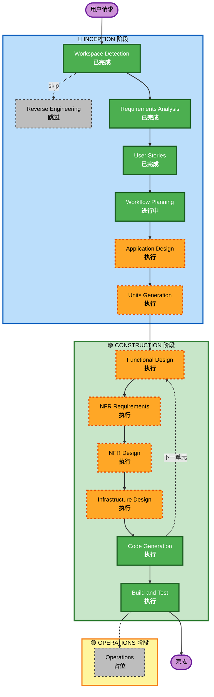

# 执行计划（Execution Plan）

## 详细分析摘要

### 项目类型
- **类型**: Greenfield 全新项目（无逆向工程需求）
- **范围**: 全栈交付（React 18 前端 + FastAPI 后端 + PostgreSQL + Redis + Celery + R2 + 采集 Worker）
- **交付方式**: 分阶段（MVP/P0 → V1/P1 → V2/P2 → P3）

### 变更影响评估

| 影响维度 | 评估 |
|---|---|
| 用户面变更 | ✅ 全新系统，9 类角色全部受影响，含 89 个可实施故事 |
| 结构性变更 | ✅ 全新架构，需定义分层、模块边界 |
| 数据模型变更 | ✅ 20+ 核心实体（style/sku/blogger/promotion/settlement/...），跨 Sheet 复杂关联 |
| API 变更 | ✅ 50+ API 端点 |
| NFR 影响 | ✅ 性能、安全、多租户、备份、审计、监控均在需求中明确 |

### 风险评估

| 项 | 评估 |
|---|---|
| 风险等级 | **中高（Medium-High）** |
| 风险来源 | 1) 多业务域大表面积；2) 外部集成有硬频控（企微每博主每天 1 条）；3) 采集 Worker 易碎（账号封禁风险）；4) 多租户安全敏感（凭据/字段级权限） |
| 回滚复杂度 | 中等 — Zeabur 多版本部署 + Alembic 可回滚迁移 + GitHub 版本控制 |
| 测试复杂度 | 复杂 — 状态机、催发实时计算、频控降级、字段级权限、多租户隔离都需要充分测试覆盖 |

### 技术栈关键决策（需求已锁定）
- React 18 + TypeScript + Ant Design 5 + Vite
- Python FastAPI + SQLAlchemy 2.0 (async)
- PostgreSQL 16（含 RLS）
- Redis 7（缓存 + Celery broker）
- Celery + Celery Beat（任务队列）
- Cloudflare R2（公开/私有桶分离）
- Zeabur 香港节点（**6 服务拆分**：frontend / backend / celery-worker / celery-beat / postgres / redis）
- 采集 Worker 独立部署（**外部执行机 / Windows VM / Docker 主机，不在 Zeabur**，通过 Celery 队列与主系统解耦）

---

## 工作流可视化



### 文本备份（Mermaid 不可用时使用）

```
[已完成] Workspace Detection (Greenfield, 全新项目)
[跳过]   Reverse Engineering (Greenfield, 无现有代码)
[已完成] Requirements Analysis (13 节, 含 GWT 验收标准)
[已完成] User Stories (89 可实施 + 5 Overview + 7 NFR Checklist + 3 P3 实验 = 104 total)
[进行中] Workflow Planning
[执行]   Application Design (新系统, 需定义层与模块)
[执行]   Units Generation (89 可实施故事按 MVP/V1/V2/P3 拆分)
[每单元] Functional Design → NFR Requirements → NFR Design → Infrastructure Design → Code Generation
[执行]   Build and Test (单元测试 + 集成测试 + API 测试)
[占位]   Operations
```

---

## 阶段执行决策

### 🔵 INCEPTION 阶段

| 阶段 | 状态 | 理由 |
|---|---|---|
| Workspace Detection | ✅ 已完成 | Greenfield 项目，无现有代码 |
| Reverse Engineering | ⏩ 跳过 | Greenfield 项目无需逆向工程 |
| Requirements Analysis | ✅ 已完成 | requirements.md 完成 13 节，含 GWT 验收标准 |
| User Stories | ✅ 已完成 | 89 可实施故事 + 5 Overview + 7 NFR Checklist + 3 P3 实验 = 104 total，附 9 个 Personas + 4 条 Journey 标签 |
| Workflow Planning | 🔄 进行中 | 当前阶段 |
| Application Design | ▶️ 执行 | **理由**：全新系统，需要识别核心组件、定义分层架构（API/Service/Repository/Domain）、明确组件依赖、为 ORM 模型规划。需求文档第 11 节虽然给了核心实体清单和约束，但没有说明服务边界、组件方法签名、依赖图。Application Design 把"业务模块"映射为"代码组件"。 |
| Units Generation | ▶️ 执行 | **理由**：89 个可实施故事如果不拆分单元就会变成一个巨型批次，违反需求第 10 节"分阶段交付，避免一次性混批生成"原则。Units Generation 按 MVP/V1/V2/P3 + Epic 边界拆出 ~20 个工作单元，每个单元可独立完成 + 验收 + 部署。 |

### 🟢 CONSTRUCTION 阶段（每个工作单元执行一遍）

| 阶段 | 状态 | 理由 |
|---|---|---|
| Functional Design | ▶️ 执行（每单元） | **理由**：系统含多个非平凡状态机（设计制版 7 状态、推广合作 3 个并行状态机、财务结款 4 状态）+ 实时计算逻辑（催发状态、爆文标记、CPL、净投产比）+ 跨表指标（投产报表 70 列）。这些必须在编码前用 Functional Design 固化。 |
| NFR Requirements | ▶️ 执行（每单元） | **理由**：需求文档第 3、11、12 节明确写了 P95≤500ms、AES-256 凭据加密、PostgreSQL RLS、字段级权限、备份 RPO/RTO 等。每个单元需要识别它落在哪些 NFR 上。 |
| NFR Design | ▶️ 执行（每单元） | **理由**：NFR 需要落地到具体的代码模式 — RLS 策略 SQL、AES-256 + KMS 加密包装、ORM 自动注入 tenant_id、字段级权限装饰器、企微频控降级算法、采集 Worker 解密审计。这些是设计而非实现细节。 |
| Infrastructure Design | ▶️ 执行（每单元） | **理由**：需求第 6.2 节明确 Zeabur 6 服务拆分 + 采集 Worker 独立部署 + R2 公开/私有桶分离 + Celery 定时任务调度。每单元的 Infrastructure Design 把功能映射到具体的服务和资源。 |
| Code Generation | ▶️ 执行（每单元） | **理由**：始终执行，按计划生成代码 |
| Build and Test | ▶️ 执行（每单元 + 每阶段末） | **理由**：每单元结束跑该单元的单元/集成测试子集；每阶段（MVP/V1/V2/P3）末跑完整 Build & Test 含跨单元集成测试。**不做"最后一次性"**，否则 V1/V2 的回归会被推到项目末尾。 |

### 🟡 OPERATIONS 阶段
| 阶段 | 状态 | 理由 |
|---|---|---|
| Operations | 🟡 占位 | AI-DLC 当前版本占位，未来扩展 |

---

## 工作单元规划（Units Generation 输入）

> 此处为预规划，正式拆分在 Units Generation 阶段确定。原则：单元 = MVP/V1/V2/P3 阶段 × Epic 子集，按依赖关系排序。

### 推荐单元划分

> **关键修订**：
> 1. EP02-S07 平台商品映射在 stories.md 中阶段为 V1，因此从 U02 (MVP) 中剥离到 U10b (V1)。U02 严格只覆盖 MVP 故事。
> 2. 统一导入（U06）拆分为 **导入框架** + 各**业务适配器**（按目标表分别依赖业务单元），避免框架强依赖所有业务单元。

| 单元 ID | 单元名称 | 阶段 | 覆盖 Epic / Story | 依赖 |
|---|---|---|---|---|
| U01 | 认证 + 多租户基础 | MVP | EP01-S01~S04, S07~S08；EP10-NFR03（多租户隔离） | — |
| U02 | 商品 / SKU 基础 | MVP | EP02-S01~S06（**不含 S07/S08**） | U01 |
| U03 | 博主库基础 | MVP | EP04-S01~S03 | U01 |
| U04 | 推广合作核心 | MVP | EP05-S02~S13 | U02, U03 |
| U05 | 财务结款核心 | MVP | EP06-S02~S08 | U04 |
| U06a | 统一导入框架 | MVP | EP07-S07~S10（仅框架：upload API、import_batch、import_job、field_mapping、hash 去重、失败重试、错误下载） | U01 |
| U06b | 商品/SKU 导入适配器 | MVP | （EP07 框架的商品/SKU 目标表绑定） | U02, U06a |
| U06c | 博主导入适配器 | MVP | （EP07 框架的博主目标表绑定） | U03, U06a |
| U06d | 推广导入适配器 | MVP | （EP07 框架的推广目标表绑定） | U04, U06a |
| U06e | 结算导入适配器 | MVP | （EP07 框架的结算目标表绑定） | U05, U06a |
| U07 | 企微集成基础 | MVP | EP08-S02~S08 | U04 |
| U08 | 发文进度看板 | MVP | EP09-S01, S07 | U04, U05 |
| U09 | 字段级权限 + 自定义权限 | V1 | EP01-S05, S06 | U01, U02, U05 |
| U10a | 设计制版全流程 | V1 | EP03-S02~S14 | U02 |
| U10b | 平台商品映射 | V1 | EP02-S07 | U02 |
| U11 | 博主智能标签 + 灰豚展示 | V1 | EP04-S04~S08 | U03, U13 |
| U12 | 平台凭据 + 采集失败告警 | V1 | EP07-S02~S06 | U01 |
| U13 | 自动数据采集 Worker | V1 | EP07-S11~S14（千牛/万相台/灰豚自动同步 + 数据质量看板） | U06a, U06b~U06e, U10b, U12 |
| U14 | 工作进度 / 爆款约篇 / 店铺数据 / 投产报表 | V1 | EP09-S02~S05 | U05, U13 |
| U15 | 企微进阶（发文通知 + 异常预警） | V1 | EP08-S09~S10 | U07 |
| U16 | 拍单 / 刷单 / 余额 | V2 | EP06-S09~S11 | U05 |
| U17 | 套装 + BI 看板 + 报表导出 | V2 | EP02-S08, EP09-S06, S08 | U02, U14 |
| U18 | AI 决策建议 | P3 | EP11-S01~S03 | U14 |

### 单元执行策略

| 项 | 说明 |
|---|---|
| 执行顺序 | 严格按阶段：U01→U08（MVP）→ U09→U15（V1）→ U16~U17（V2）→ U18（P3） |
| 阶段内并行 | 同阶段内若依赖允许可并行（如 U02 / U03 无相互依赖；U06b/c/d/e 适配器在各自业务单元就绪后可并行） |
| 阶段间硬隔离 | 每完成一个阶段（MVP 共 12 个 sub-unit；V1 共 7；V2 共 2；P3 共 1）必须先做完整 Build & Test 验收，再启动下一阶段 |
| 关键路径 | MVP 关键路径：U01 → U02 → U04 → U05 → U07 → U08，任一阻塞延后 MVP 上线；U06a → U06b/c/d/e 是导入并行支线 |
| 测试检查点 | **每单元末尾跑该单元的单元测试 + 该单元相关 API 集成测试**；**每阶段末尾跑完整 Build & Test 含跨单元集成测试和阶段级回归** |
| 回滚策略 | Alembic 迁移可向下回滚；Zeabur 多版本可流量切换；GitHub 标签每阶段打 tag |

### 单元小计

| 阶段 | 单元数 |
|---|---|
| MVP | **12 个 sub-unit**（U01, U02, U03, U04, U05, U06a, U06b, U06c, U06d, U06e, U07, U08） |
| V1 | **8 个 sub-unit**（U09, U10a, U10b, U11, U12, U13, U14, U15） |
| V2 | 2 个（U16, U17） |
| P3 | 1 个（U18） |
| **合计** | **23 个 sub-unit** |

> **关于 U06b~U06e 适配器的故事覆盖**：这 4 个适配器单元共享 EP07-S07~S10 的故事和 GWT 验收标准。每个适配器单元的额外验收 = 该适配器对应业务表的字段映射配置 + 该业务表的导入端到端样本 CSV 跑通。故事 ID 不重新分配，但 Construction 阶段 Functional Design 会为每个适配器写各自的字段映射规则。

---

## 估算时间线

> 时间为粗估，实际执行受 AI-DLC 工具效率和外部集成调试影响。

| 阶段 | 单元数 | 估算工作量 |
|---|---|---|
| Application Design | 1 | 0.5 个迭代（生成组件清单和依赖图） |
| Units Generation | 1 | 0.5 个迭代（细化上面的单元划分） |
| MVP（U01-U08，含 U06a~U06e） | 12 sub-unit | MVP 关键单元 1 迭代/个，导入适配器 0.5 迭代/个 ≈ 9.5 个迭代 |
| V1（U09-U15，含 U10a/U10b） | 8 sub-unit | 8 × 1 个迭代/单元 = 8 个迭代 |
| V2（U16-U17） | 2 | 2 × 0.5 个迭代/单元 = 1 个迭代 |
| P3（U18） | 1 | 1 个迭代 |
| 阶段末 Build & Test | 4 次 | 各 0.5 个迭代 = 2 个迭代 |
| **合计** | **~23 sub-unit** | **~22 个迭代** |

> 一个"迭代"在 AI-DLC 上下文中 ≈ 一轮完整的 Functional/NFR/Infra/Code 设计 + Code 生成 + 用户审核。

---

## 成功标准

### 主要目标
基于已批准的需求文档（13 节）和 89 个可实施故事，分阶段交付一个可在 Zeabur 部署的服装电商运营管理系统。

### 关键交付物

| 阶段 | 关键交付物 |
|---|---|
| MVP | 用户登录 + 商品/SKU/博主 CRUD + 推广合作核心 + 结算核心 + 手动导入 + 企微催发 + 发文进度看板，可在本地 Docker 启动并部署到 Zeabur |
| V1 | 字段级权限 + 设计制版流程 + 博主智能标签 + 自动采集 Worker + 投产报表 + 企微异常预警 |
| V2 | 拍单/刷单/余额 + 套装 + BI 看板 + 报表导出 |
| P3 | AI 推广策略 / 异常归因 / 博主选择建议（不阻塞前阶段） |

### 质量门（每单元，按阶段差异化）

**所有单元（MVP 起即生效）**：
- ✅ 该单元覆盖的所有可实施故事的 GWT 验收标准全部通过
- ✅ 单元相关的单元测试覆盖核心业务逻辑
- ✅ 关键 API 有集成测试
- ✅ 数据库迁移可正向升级和回滚
- ✅ **不引入跨租户数据泄露**（U01 起就生效，多租户是 MVP 强制能力）
- ✅ **模块级 / 功能级权限按角色生效**（U01 起即生效）
- ✅ 关键操作写入 audit_log

**仅 V1 及以后单元**：
- ✅ **字段级权限按角色屏蔽敏感字段**（**U09 完成后才生效**，U09 之前的 MVP 单元不强制）

> 说明：字段级权限是 V1 才交付的能力（EP01-S05/S06）。MVP 阶段所有 cost_price / quote / payment_amount 等字段对有模块写权限的角色都可见，符合阶段化交付原则。U09 完成后所有现有 API 必须重新做字段级权限回归。

### 集成测试门（每阶段末，跑完整 Build & Test）

| 阶段末 | 集成测试范围 |
|---|---|
| MVP 末 | 跨单元数据流通（U02→U04→U05、U06a/b/c/d/e→各业务表）；催发状态实时计算端到端；推广→结算自动生成；企微频控降级；多租户隔离回归；性能 P95 ≤ 500ms 抽样 |
| V1 末 | 设计制版 7 状态机端到端；自动采集 Worker → 导入 → 入库 → 报表全链路；字段级权限回归（重点）；投产报表跨表聚合校验；凭据加密 + 解密审计 |
| V2 末 | 刷单 ROI 隔离回归；拍单自动生成；余额平账；BI 看板和导出 |
| P3 末 | AI 服务降级测试；不阻塞前阶段功能验收 |

---

## 关键约束与风险缓解

### 已识别风险

| 风险 | 缓解措施 |
|---|---|
| 采集 Worker 易碎（账号封禁、验证码） | 凭据失败 N 次自动暂停 + 企微告警；引导用户用子账号；最小权限原则 |
| 企微频控（每博主/PR 每天 1 条） | 频控降级到站内通知；wecom_message 状态跟踪 |
| 多租户字段级权限复杂度 | NFR Design 阶段固化权限装饰器和测试样例库 |
| 状态机回退/取消的副作用 | Functional Design 用状态转移表精确建模，单元测试覆盖每个转移 |
| 报表跨表聚合性能 | NFR Design 加索引设计；必要时增物化视图 |
| 阶段化交付边界变化 | 每阶段独立 GitHub tag；Alembic 迁移可回滚 |

### 已锁定的高敏感能力门槛
（详见 requirements.md 第 12 节）

- ✅ 凭据 AES-256 加密 + 不可回显 + 解密审计 + 暂停删除 + 失败告警
- ✅ 字段级权限按角色屏蔽（cost_price / quote / payment_amount 等）
- ✅ audit_log 仅 append-only
- ✅ 多租户共享 DB + tenant_id + RLS + 文件路径隔离
