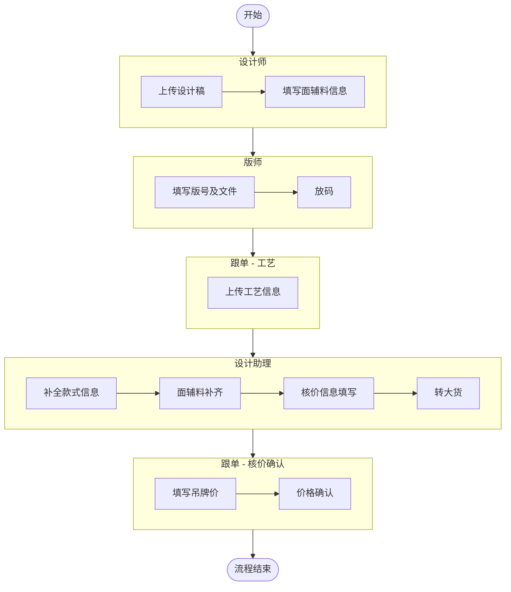

# 服装电商运营管理系统 — 开发文档

> 版本：V2.0（整合V1需求 + V2修订 + 技术设计）
> 数据源：final.xlsx（指标字典 + 业务数据）
> 技术栈：React + FastAPI + PostgreSQL + Redis + Cloudflare R2 + Zeabur

---

## 一、项目背景

用户为女装电商老板，日常需在千牛、灰豚、ERP等多系统间切换。核心痛点：数据分散、录入低效、报表失真（刷单混入）、决策靠经验、催发靠人工、结款流程散。

系统定位：一站式服装电商运营管理平台，整合多源数据，提供智能录入、可视化看板、企微自动化推送。

---

## 二、技术架构

| 层级 | 技术 | 说明 |
|------|------|------|
| 前端 | React 18 + TypeScript + Ant Design 5 + Vite | 组件化，中文友好 |
| 后端 | Python FastAPI + SQLAlchemy 2.0 (async) | 异步高性能 |
| 数据库 | PostgreSQL 16 | 复杂查询和报表 |
| 缓存 | Redis 7 | 会话/缓存/任务队列 |
| 任务队列 | Celery + Redis | 催发/爬虫/数据同步 |
| 图片存储 | Cloudflare R2 + CDN | 免费存储，兼容S3 API，自带CDN |
| 部署 | Zeabur（香港节点） + Docker | PaaS部署，大陆可访问 |
| AI | DeepSeek V4 | 决策建议（P3） |

---

## 三、侧边栏导航（以Excel Sheet为蓝本）

每个Sheet页对应系统中的一个页面：

```
侧边栏:
├── 🎨 设计制版
│   ├── 设计管理            ← 新增设计款、面辅料、转大货
│   ├── 制版管理            ← 版号、制版文件、放码
│   ├── 工艺管理            ← 工艺信息录入
│   └── 核价管理            ← 核价填写、吊牌价、价格确认
├── 📊 数据管理
│   ├── 商品成本表          ← 301行×14列，全系统底座
│   ├── 博主库              ← 1763行×41列，博主资产
│   ├── 千牛数据            ← 12207行×38列，外部导入
│   └── 单品站内推广数据    ← 3023行×72列，外部导入
├── 📝 推广管理
│   ├── 站外推广2026年度    ← 5494行×38列，核心录入表
│   ├── 工作进度表          ← 73行×32列，PR月度KPI
│   ├── 爆款约篇数量        ← 43行×18列，约篇目标
│   └── 发文进度表          ← 389行×23列，三层看板
├── 💰 财务管理
│   ├── 财务结款            ← 1428行×15列，佣金结算
│   ├── 拍单                ← 10行×11列
│   ├── 刷单                ← 53行×17列
│   └── 余额核对            ← 142行×11列
├── 📈 报表与分析
│   ├── 店铺数据            ← 127行×24列，日报汇总
│   ├── 投产报表            ← 35行×70列，核心决策
│   └── BI看板              ← 可视化仪表盘
└── ⚙️ 系统管理
    ├── 用户管理
    ├── 权限配置（自定义）
    └── 系统设置
```

---

## 四、用户角色与权限

### 4.1 预设角色

| 角色 | 可访问模块 | 特殊权限 |
|------|-----------|----------|
| 管理员 | 所有模块 | 权限配置、数据回滚 |
| 设计师 | 设计管理（读写）、商品成本表-打样（读写） | 新增设计款、面辅料填写上传 |
| 设计助理 | 设计管理（读写）、核价管理（填写） | 面辅料补齐、核价信息填写、转大货 |
| 版师 | 制版管理（读写） | 上传制版文件、填写版号、放码 |
| 跟单 | 商品成本表（读写）、工艺管理（读写）、核价管理（审批） | 上传工艺信息、填写吊牌价、价格确认 |
| PR | 博主库、站外推广（读写）、发文进度（只读） | 填写推广信息 |
| PR主管 | PR全部 + 财务结款（核查+增加项） | 审核、增加结算项 |
| 财务 | 财务结款-付款、拍单、刷单、余额核对 | 付款截图上传 |
| 运营 | 店铺数据、千牛数据、投产报表、BI看板（只读） | |

> ⚠️ **当前阶段说明**：人员有限，设计师与设计助理由同一人兼任。系统保留两个独立角色定义，当前为同一用户同时分配两个角色权限。后续团队扩编时，只需新建用户并分配单一角色即可拆分，无需修改系统代码。

### 4.2 自定义权限

- 支持为单个用户自定义权限，覆盖角色默认权限
- 权限粒度：模块级（可见/不可见）+ 功能级（增/删/改/查/导入/导出）+ 字段级（敏感字段如成本价/佣金）
- 权限矩阵配置界面：行=模块，列=角色/用户，单元格=允许/禁止
- 「提交财务付款」权限需单独开放

---

## 五、数据源与导入机制

### 5.0 Excel 数据结构与指标字典说明

`final.xlsx` 是系统设计的字段结构和指标口径参考文件。系统不以当前样例数据行数、空值情况作为生产约束，而以 Sheet 字段结构、字段来源、计算逻辑和模块归属为准。

其中 `指标统计` Sheet 作为系统指标字典和字段血缘的基础来源，用于说明每个字段属于哪个业务模块、由谁产生、如何计算、是否参与报表、是否允许人工编辑。

开发过程中，所有核心报表指标必须从指标字典中追溯来源，不得仅根据页面展示字段或 Excel 公式直接实现。

> 详细指标字典见 `指标字典.md`。

### 5.0.1 Excel Sheet 与系统模块映射

| Excel Sheet | 系统模块/逻辑表 | 类型 | 说明 |
|---|---|---|---|
| 指标统计 | 指标字典/数据血缘 | 元数据 | 定义字段归属、来源、计算逻辑，不作为业务录入页面 |
| 商品成本表 | 款式(style) + SKU(sku) | 源数据 | 实际为SKU级数据，款式编码可重复，商品编码唯一 |
| 博主库 | 博主资产库(blogger) | 源数据+计算指标 | 人工字段、采集字段、系统计算字段混合 |
| 站外推广表 | 推广合作(promotion) | 核心业务表 | 记录每笔博主合作、发布、召回、催发和成本数据 |
| 站外结款表 | 财务结款(settlement) | 业务流转表 | 来源于推广合作，财务付款后补充付款信息 |
| 拍单 | 订单调整(order_adjustment) | 业务流转表 | 通过 order_type 区分拍单、刷单 |
| 余额核对 | 财务余额流水 | 业务表 | 记录充值、推广支出、刷/拍单支出和余额 |
| 千牛数据 | 千牛商品日报(qianniu_daily) | 外部导入 | 商品维度日报数据 |
| 单品站内推广数据 | 站内推广日报(ad_daily) | 外部导入 | 万相台/站内广告数据 |
| BI看板 | 工作进度/月度PR看板 | 报表 | 按PR和月份汇总推广进度 |
| BI_发文进度表 | 发文进度看板 | 报表 | 按款式维度汇总推广进度 |
| BI_工作进度表 | 工作进度看板 | 报表占位 | 由系统动态生成 |
| BI_投产报表 | 投产报表 | 报表占位 | 由系统动态生成 |
| BI_店铺数据 | 店铺数据看板 | 报表占位 | 由系统动态生成 |

### 5.0.2 统一导入入口

外部数据不论来自数据采集引擎、用户手动上传，还是后续其他来源，都必须通过统一导入入口进入系统。

统一链路为：

```
上传文件/采集结果 → import_batch → import_job → field_mapping → 数据校验 → 入库 → 失败明细下载/重试
```

历史 Excel 中"每天更新到固定文件夹"的方案为早期方案，不作为当前开发实现依据。

### 5.1 三大原始数据表

| 数据表 | 来源 | 导入方式 | 数据量 |
|--------|------|----------|--------|
| 站外推广2026年度 | PR手动录入 | 系统内直接录入 | 5494行 |
| 千牛数据 | 千牛客户端导出 | 数据采集引擎自动同步 + 手动上传 | 12207行 |
| 单品站内推广数据 | 万相台导出 | 数据采集引擎自动同步 + 手动上传 | 3023行 |

### 5.2 数据导入方案（API上传模式）

由于系统部署在 Zeabur 云端，采用"自动数据同步 + 手动上传"双模式：

**方式1：数据采集引擎自动同步（主要方式）**
- 用户在系统中配置目标平台（千牛/万相台/灰豚）的账号密码
- 系统内置数据采集引擎定时登录目标平台，抓取最新数据
- 采集完成后自动解析、校验、入库
- 用户无需任何手动操作，数据自动同步

**方式2：手动上传（兜底）**
- 系统界面提供Excel/CSV上传功能
- 适用于采集引擎异常时的手动补录

**导入链路设计**：

```
数据采集引擎 / 手动上传
  ↓ 创建 import_batch（导入批次）
  ↓ 文件 hash（SHA256）去重，相同文件不重复导入
  ↓ 按 field_mapping_version 解析字段
  ↓ 逐行校验，生成 import_job（导入任务明细）
  ↓ 成功行写入业务表，失败行记录错误详情
  ↓ 更新批次状态（成功/部分失败/全部失败）
```

**核心表**：
- `import_batch`：batch_id、tenant_id、source、file_name、file_hash、status、total/success/failed、created_at
- `import_job`：job_id、batch_id、row_number、status、error_detail、raw_data
- `field_mapping`：source、version、mapping_config（JSON）

**幂等机制**：file_hash（SHA256）去重，相同文件不重复导入

**失败处理**：
- 失败明细可下载CSV
- 支持单条/批量重试
- 重试策略：自动重试3次，间隔指数退避（1s/5s/30s）

**字段映射版本**：mapping_version字段，平台格式变化时新增版本而非覆盖

**API接口**：
```
POST /api/import/upload
  Header: Authorization: Bearer {token}
  Body: multipart/form-data
    - file: CSV/Excel文件
    - source: "qianniu" | "wanxiangtai" | "huitun"
  Response: { success: true, batch_id: "xxx", imported: 1200, failed: 3 }
```

**用户平台账号密码安全方案**：

用户需要将千牛/万相台等平台的账号密码提供给系统，供数据采集引擎登录抓取数据。

安全措施（P0交付）：
- 密码使用 AES-256 加密存储，加密密钥与数据库分离（存环境变量）
- 按租户独立加密密钥，租户间凭据互不可见
- 界面上密码显示为 `****`，不可回显明文
- 所有解密操作记录审计日志（谁、何时、解密了哪个凭据）
- 采集引擎运行时解密使用，用完即释放
- 隐私协议中明确告知用户数据存储方式
- 各平台建议使用子账号（只读权限），不用主账号

安全增强（P1）：
- KMS托管密钥：用云端KMS加密数据密钥
- 密钥自动轮换：每90天自动轮换
- 凭据删除：用户可随时删除已存储的凭据
- 访问审批：解密操作需管理员审批（可选）

### 5.3 灰豚数据（博主库）

- 数据采集引擎从灰豚抓取博主画像数据，自动同步入库
- 数据范围：粉丝画像、笔记数据、涨跌趋势、笔记互动数据
- 所有小红书相关数据统一通过灰豚获取

### 5.4 特殊格式处理

| 格式 | 处理方式 |
|------|----------|
| WPS DISPIMG | 解析图片ID，提取并存储 |
| 万单位(17.9w) | 解析为179000 |
| 日期序列号(46006) | 转换为2026-01-06 |
| 金额表达式(636.9-283) | 计算为353.9 |
| 合并单元格 | 识别范围，填充子行 |

### 5.5 数据质量规则

系统在导入和业务流转时必须校验数据质量，异常记录写入 `data_quality_issue` 表。

**P0 级校验规则**：

| 场景 | 规则 | 严重级别 |
|------|------|:---:|
| 推广记录 | 款式编码为空或无法关联商品 → 标记 `unmatched_product` | error |
| 推广记录 | 博主ID为空或无法关联博主 → 标记 `unmatched_blogger` | error |
| 已发布记录 | 发布链接、发布日期、点赞量缺失 → 提示补全 | warning |
| 待结算记录 | 金额、博主、款式、合作方式缺失 → 禁止提交财务 | error |
| 千牛日报 | 商品ID + 日期重复 → 幂等更新 | info |
| 站内推广日报 | 主体ID + 日期重复 → 幂等更新 | info |
| 拍单/刷单 | 订单号重复 → 提示并要求确认 | warning |
| 财务付款 | 付款金额、日期、截图缺失 → 不能标记已付款 | error |

**数据质量表（data_quality_issue）**：

| 字段 | 说明 |
|------|------|
| id | 主键 |
| tenant_id | 租户 |
| source | 来源（qianniu/wanxiangtai/promotion等） |
| batch_id | 导入批次（可为空） |
| table_name | 目标表 |
| record_id | 关联记录ID |
| field_name | 异常字段 |
| issue_type | 缺失/重复/格式错误/无法关联/状态异常 |
| severity | info/warning/error |
| raw_value | 原始值 |
| message | 错误说明 |
| status | open/ignored/fixed |

---

## 六、功能模块详细设计

### 6.0 设计制版管理（设计到定价流程）

> 服装从设计到定价的核心前置流程，是商品成本表数据的上游来源。

#### 业务流程



#### 角色职责

| 序号 | 角色 | 操作步骤 | 系统模块 |
|------|------|----------|----------|
| 1 | 设计师 | 上传设计稿 | 设计管理：新增设计款 |
| 2 | 设计师 | 填写面辅料信息 | 设计管理：面辅料填写上传 |
| 3 | 版师 | 填写版号及文件 | 制版管理：上传制版文件、版号 |
| 4 | 版师 | 放码 | 制版管理：放码 |
| 5 | 跟单 | 上传工艺信息 | 工艺管理：上传工艺信息 |
| 6 | 设计助理 | 补全款式信息 | 设计管理：面辅料补齐 |
| 7 | 设计助理 | 核价信息填写 | 核价管理 |
| 8 | 设计助理 | 转大货 | 设计管理：转大货 |
| 9 | 跟单 | 填写吊牌价 | 核价管理：填写吊牌价 |
| 10 | 跟单 | 价格确认 | 核价管理：已核价-价格确认 |

#### 子模块说明

**设计管理**
- 新增设计款：设计师上传设计稿图片，创建款式记录
- 面辅料填写：设计师录入面料、辅料信息
- 面辅料补齐：设计助理核查并补全面辅料数据
- 转大货：设计助理确认信息完整后，将款式状态转为大货

**制版管理**
- 上传制版文件：版师上传版型文件，填写版号
- 放码：版师根据版型完成各尺码放码

**工艺管理**
- 上传工艺信息：跟单录入生产工艺要求，供工厂参考

**核价管理**
- 核价信息填写：设计助理录入成本构成信息
- 填写吊牌价：跟单填写最终吊牌价
- 价格确认：跟单完成核价审批，确认最终定价

#### 流程状态流转

款式状态：`设计中` → `制版中` → `工艺录入` → `待补全` → `待核价` → `已确认` → `大货`

**完整状态流转表**：

| 当前状态 | 可执行动作 | 操作角色 | 前置必填 | 下一状态 | 可回退 | 副作用 |
|----------|-----------|----------|----------|----------|:---:|------|
| 设计中 | 提交面辅料 | 设计师 | 设计稿+面辅料 | 制版中 | ✅ | 通知版师 |
| 制版中 | 提交版型+放码 | 版师 | 版号+制版文件+放码 | 工艺录入 | ✅ | 通知跟单 |
| 制版中 | 驳回 | 版师 | 驳回原因 | 设计中 | — | 通知设计师 |
| 工艺录入 | 提交工艺 | 跟单 | 工艺信息 | 待补全 | ✅ | 通知设计助理 |
| 工艺录入 | 驳回 | 跟单 | 驳回原因 | 制版中 | — | 通知版师 |
| 待补全 | 补全+核价填写 | 设计助理 | 面辅料完整+核价信息 | 待核价 | ✅ | 通知跟单 |
| 待补全 | 驳回 | 设计助理 | 驳回原因 | 工艺录入 | — | 通知跟单 |
| 待核价 | 确认价格+转大货 | 跟单 | 吊牌价 | 大货 | ✅ | 通知设计师 |
| 待核价 | 驳回重新核价 | 跟单 | 驳回原因 | 待补全 | — | 通知设计助理 |
| 任意状态 | 取消 | 管理员 | 取消原因 | 已取消 | ❌ | 记录审计日志 |

每个角色完成操作后，系统自动将状态推进到下一环节，并通知下一角色处理。驳回时附带原因，被驳回方收到通知。

---

### 6.1 商品成本表（SKU明细）

> 全系统数据底座。`style_code` 在款式表(style)中唯一，`sku_code` 在SKU表(sku)中唯一。商品成本表实际是SKU级明细数据，同一款式下可存在多个颜色/尺码的SKU。

| 字段 | 类型 | 说明 |
|------|------|------|
| 款式编码 | 文本 | 关联style表，同一款式下可有多个SKU |
| 商品编码 | 文本(唯一) | SKU唯一标识，对应sku表的sku_code |
| 主商品ID | 文本 | 千牛商品ID，关联platform_product表 |
| 图片 | 图片 | 支持DISPIMG格式和拖拽上传 |
| 商品简称 | 文本 | 款式层字段，如「波点花边长袖」 |
| 颜色及规格 | 文本 | SKU层字段 |
| 成本价 | 金额 | SKU层，用于利润计算，下游自动引用 |
| 商品标签 | 多选 | 款式层，如「2026春款主推」，用于全局筛选 |

成本核算：
- 自动核价：成本价 = 面料用量 + 辅料用量 + 工艺费（可选）
- 手动核价：直接输入成本价
- 下游联动：站外推广「总成本」、投产报表毛利自动引用

### 6.2 博主库

> 1763行×41列，博主资产沉淀

核心字段：联系人、小红书昵称、小红书ID(唯一)、邮箱、微信号、报价、粉丝量、3/7/14篇阅读量/点赞数/收藏数/评论数

系统计算字段：
- 阅读点赞比 = 点赞/阅读
- 收藏赞比 = 收藏/点赞
- 近期涨跌 = 基于3天/7天/14天数据对比
- 是否假号 = 阅读点赞比≤假号阈值（默认0.1，可配置）则为否
- 博主类型：粉丝<1W→素人，1W-10W→KOC，≥10W→KOL
- 质量标签：高性价比、带货型（阈值可配置）

灰豚数据字段：活跃粉丝数、阅读粉丝比、粉丝画像/占比/年龄、笔记数、爆文率

### 6.3 站外推广2026年度（核心录入表）

> 5494行×38列，记录每笔博主合作全生命周期

PR手动填写字段：负责PR、品名、打单地址、合作平台、报价、博主id、合作日期、预定发布日期、订单号、博主类型、微信、合作方式、合作形式、博主风格、买家秀截图

系统自动计算/填充字段：
- 货号：通过品名按 style_code 关联商品表自动获取
- **款号↔商品简称双向关联：输入款号自动填充商品简称，输入商品简称自动填充款号**
- 重复检测：同一款号+博主自动标记重复
- 双平台标记：同一款号在不同平台标记为「双平台」
- 催发状态：基于发布状态和剩余时间自动计算
- 爆文标记：点赞≥爆文阈值（默认1000，可配置）标记为「是」
- 总成本：按 style_code 关联商品表获取
- 去重后实际点赞量：抖音点赞÷抖音折算系数（默认10，可配置）
- 单件点赞成本：总成本/去重点赞量

催发状态逻辑：
```
已取消 → "已取消"
已发布 → "已发布"
剩余>10天 → "档期内"
剩余≤10天且>3天 → "催发"
剩余≤3天 → "重要催发"（红色）
已超时 → "超时"（红色），≥3天重点标记
```

企微自动催发：检测催发/重要催发/超时状态 → 通过博主微信号发送催发消息（模板可编辑，支持变量替换）

### 6.4 工作进度表（新增）

> 73行×32列，按PR统计月度工作进度

按月份分区，每月统计每个PR的：
- 约篇件数、档期内/催发/重要催发/超时/已发布数量
- 信息完整度（已填写点赞量/已发布）
- 已取消/应召回/召回成功/召回完成率
- 超时率、月度完成率
- 爆文数(≥爆文统计阈值，默认500赞，可配置)、爆文率
- 点赞数、成本（含衣服）、CPL（元/赞）

所有数据从推广合作表按条件聚合查询汇总。
**支持时间筛选（按月份切换）。**

### 6.5 爆款约篇数量（新增）

> 43行×18列，按款号设置最低约篇目标

| 字段 | 说明 |
|------|------|
| 负责PR | PR名称 |
| 款号 | 商品款式编码 |
| 商品名称 | 按 style_code 关联商品表 |
| 最低约篇 | 人工设置目标 |
| 统计日期 | 月份 |
| 实际约篇 | 按条件聚合查询统计 |
| 状态 | 达标/未达标 |
| 缺口/超额 | =实际-最低 |

可整合到发文进度表中，作为每个商品卡片的约篇目标提示。
**支持时间筛选。**

### 6.6 发文进度表（三层看板）

> 389行×23列，按款式维度汇总推广进度

**第一层：全局推广数据汇总区**
- 约篇金额、约篇量、合作金额、发布量、发布率、超时率、点赞量、点赞成本、取消量
- 指标卡片横排，颜色区分（绿/黄/红）
- **支持时间范围筛选**

**第二层：商品卡片网格**
- 每个商品一张卡片（PC每行4个，响应式）
- 卡片内容：图片、品名、颜色、款号、成本、约篇量/金额、发布量/金额、取消量、点赞量、超时量、点赞成本
- 发布率/超时率进度条可视化
- 支持排序、搜索、导出

**第三层：商品详情面板（右侧抽屉）**
- Tab 1: PR维度明细（每个PR的约篇量/发布量/完成率/超时率/点赞成本）
- Tab 2: 时间维度明细（半月周期趋势 + 折线图）

### 6.7 财务结款（原站外推广表）

> 1428行×15列，佣金结算

| 字段 | 说明 |
|------|------|
| 月份/日期 | |
| 大类 | 站外推广 |
| 项目 | 佣金/运费/赞奖 |
| 款号 | 按 style_code 关联商品表自动获取 |
| 款式 | 商品简称 |
| 金额 | |
| 寄/送 | 合作方式 |
| 博主名 | |
| 付款金额 | PR主管填写 |
| 付款日期 | 财务填写 |
| 付款图片 | 财务上传（拖拽） |
| 备注 | |

结算流程：博主发布 → 系统自动生成佣金记录 → 系统初查 → PR主管核查 → 填写付款金额 → 提交财务 → 财务付款上传截图

### 6.8 拍单

> 运营填写基本信息 → 提交财务审核 → 财务付款上传截图

站外推广「店铺拍单=是」时自动生成拍单记录。通过内部编码自动填充博主信息和商品信息。

### 6.9 刷单

> 53行×17列，刷单记录独立管理

- 金额支持「原价-返现」格式自动解析
- 刷单订单号在计算真实ROI时自动剔除
- 报表中刷单数据单独展示，不混入正常统计

### 6.10 余额核对

> 142行×11列

- 余额 = 上一笔余额 + 收入 - 支出（自动计算）
- 充值行仅填收入，推广行仅填支出
- 不一致时红色报错

### 6.11 店铺数据

> 127行×24列，千牛数据按日汇总

所有字段通过SUMIF从千牛数据表计算。手动输入：全站推消耗、直通车消耗、引力魔方消耗。
**支持时间范围筛选（近7天/30天/自定义）。**

### 6.12 投产报表

> 35行×70列，按款式维度汇总全链路数据

核心计算公式：
```
退货退款率 = 成功退款金额 / 支付金额
待确认收货金额 = 支付金额 - 成功退款金额
加购成本 = (站外成本 + 站内投放) / 总加购数
净投产比 = 待确认收货金额 / 推广总花费
推广单件成交成本 = 加购成本 / 加购转化率 / (1-退货率)
```

数据来源跨多个表：千牛数据、站外推广、单品站内推广、发文进度。
**支持时间范围筛选 + 周环比数据框。**

### 6.13 千牛数据（外部导入）

> 12207行×38列，商品维度日报

通过数据采集引擎自动同步或手动上传。38列完整字段。通过商品ID+日期绑定。

### 6.14 单品站内推广数据（外部导入）

> 3023行×72列，站内付费推广效果

通过数据采集引擎自动同步或手动上传。72列完整字段。日期格式支持「20250901至20251031」。

---

## 七、看板与报表时间筛选

所有看板和报表页面统一增加时间筛选组件：

| 筛选选项 | 说明 |
|----------|------|
| 近7天 | 快捷选项 |
| 近30天 | 快捷选项 |
| 本月 | 快捷选项 |
| 上月 | 快捷选项 |
| 自定义日期范围 | DateRangePicker |

适用页面：发文进度表、工作进度表、店铺数据、投产报表、BI看板、爆款约篇数量

---

## 八、企业微信集成

### 催发方案

博主已加为企微外部联系人（企微 ↔ 个人微信好友），系统通过企微「客户联系 - 群发助手」API 直接给博主发送催发消息。

```
系统定时检测催发状态
  ↓ 筛选出需要催发的博主（external_userid）
  ↓ 调用企微群发助手API，创建群发任务
  ↓ 指定发送人（PR的企微账号）+ 接收人（博主）
  ↓ PR企微端确认发送（或静默发送）
  ↓ 博主在个人微信上收到催发消息
```

**API接口**：`POST https://qyapi.weixin.qq.com/cgi-bin/externalcontact/add_msg_template`

**限制**：
- 每个博主每天最多收到 1 条企业群发消息
- 每个PR每天最多发送 1 次群发（一次可发给多个博主）
- 超出限制时降级为"通知PR手动催发"模式

### 推送场景

| 场景 | 触发条件 | 推送方式 | 推送内容 |
|------|----------|----------|----------|
| 催发提醒 | 距预定发布≤10天 | 企微群发→博主 | "{博主昵称}您好，{商品简称}的发布日期快到了，请尽快安排~" |
| 重要催发 | 距预定发布≤3天 | 企微群发→博主 | 更紧急的催发消息 |
| 超时催发 | 已超时未发布 | 通知PR手动催发 | 因每天1条限制，超时后由PR手动联系 |
| 发文通知 | PR填入发布链接 | 企微群聊机器人 | 通知控评 |
| 异常预警 | 退货率/转化率/投产比异常 | 企微自建应用→管理群 | 推送预警 |

### 技术实现

- 企微自建应用：创建应用获取 corp_id + secret + agent_id
- 外部联系人管理：通过API获取博主的 external_userid
- 博主微信号绑定：博主表增加 `wecom_external_userid` 字段，通过"获取客户列表"API按微信号匹配
- 群发消息API：创建群发任务，支持文本/图片/链接
- 消息模板可自由编辑，支持变量：{博主昵称}、{商品简称}、{预定发布日期}、{剩余天数}
- 定时任务（Celery Beat）每天执行催发状态扫描
- 降级策略：群发限制触发时，自动切换为企微内部消息通知PR
- 发送需要员工在企微端确认（企微平台限制）

### 企微消息状态表

| 状态 | 说明 |
|------|------|
| pending | 待创建群发任务 |
| created | 已创建，待员工确认 |
| sent | 已发送 |
| rejected | 员工拒绝发送 |
| rate_limited | 频控降级（改为通知PR手动催发） |
| failed | 发送失败 |

系统记录每个博主当天已收到的群发次数，超出限制自动降级。企微回调通知发送结果，系统更新消息状态。

---

## 九、异常监控与预警

| 预警规则 | 触发条件 | 推送方式 |
|----------|----------|----------|
| 退货率偏高 | >阈值(默认40%) | 企微 |
| 转化率骤降 | 日环比下降>30% | 企微 |
| 博主超时 | 超时→催发；≥3天→重点标记 | 企微+系统红色 |
| 余额异常 | 校验不等式不成立 | 系统红色报错 |
| 净投产比过低 | <阈值 | 企微 |
| 博主数据暴跌 | 近期数据大幅下跌 | 系统预警标注 |
| 笔记24h爆发 | 24h点赞>100 | 系统特殊标记 |

所有阈值可在系统设置中配置。

---

## 十、数据关联设计

全局关联键：
- 「款式编码/货号」→ 贯穿商品成本表、站外推广、千牛数据、投产报表
- 「主商品ID」→ 关联千牛数据、单品推广数据、投产报表
- 「品名/商品简称」↔「款号」→ 双向字段关联查询
- 「博主昵称/小红书ID」→ 关联博主库、站外推广
- 「内部编码」→ 站外推广唯一标识，贯穿财务结款、拍单、发文进度

模块间联动：
```
商品成本表.款式编码 ──→ 站外推广.货号 ──→ 财务结款.款号 ──→ 投产报表
                    ──→ 千牛数据.货号
商品成本表.主商品ID ──→ 千牛数据.主商品ID ──→ 投产报表.主商品ID
站外推广.内部编码   ──→ 财务结款（自动生成）
                    ──→ 拍单（店铺拍单=是时自动生成）
博主库.小红书昵称   ──→ 站外推广.博主id ──→ 拍单.博主名字
```

---

## 十一、非功能性需求

| 指标 | 要求 |
|------|------|
| API响应 | ≤500ms (P95) |
| 页面加载 | ≤3秒 |
| 并发用户 | ≥50人 |
| 可用性 | ≥99.5% |
| 数据备份 | 每日自动(pg_dump→Cloudflare R2) |
| 备份保留 | 最近30天每日备份 + 每月1份保留1年 |
| RPO | ≤24小时（每日备份） |
| RTO | ≤4小时（从备份恢复） |
| 恢复演练 | 每季度一次备份恢复演练 |
| 安全 | JWT+bcrypt+RBAC+HTTPS+API限流+CORS |
| API限流 | slowapi库，防止恶意请求 |
| CORS | 只允许 app.clothinkai.com 访问API |
| 日志 | 结构化JSON日志，所有关键操作记录 |
| 监控 | API响应时间、错误率、数据库连接数 |
| 任务告警 | Celery任务失败 → 企微通知管理员 |
| 数据库迁移 | Alembic管理schema变更，支持回滚 |
| 灰度/回滚 | Zeabur支持多版本部署，流量切换 |
| 导出 | 按模块导出Excel，含衍生字段 |
| 除零处理 | 分母为0时显示"—"或0，不报错 |
| 生产管理员 | 首次启动随机生成密码，强制修改 |

### 文件存储分区

```
Cloudflare R2 存储分区：
├── public/          → 商品图片、设计稿预览图（走CDN公开访问）
├── private/         → 付款截图、订单截图、买家秀（签名URL，有效期15分钟）
├── credentials/     → 加密的平台凭据备份（仅后端可访问）
└── backups/         → 数据库备份文件（仅后端可访问）
```

敏感图片（付款截图、订单截图）不走公开CDN，使用私有桶 + 签名URL访问。

---

## 十二、功能优先级

| 优先级 | 功能 |
|--------|------|
| P0-核心 | 商品成本表、站外推广2026年度、催发系统+企微、财务结款、发文进度表 |
| P0-核心 | 数据采集引擎自动同步（千牛/万相台/灰豚）|
| P0-核心 | 款号↔商品简称双向关联、成本自动计算 |
| P0-核心 | 爆文识别、PR主管审核流程 |
| P1-重要 | 设计管理、制版管理、工艺管理、核价管理（设计制版流程） |
| P1-重要 | 工作进度表、爆款约篇数量、博主库+智能标签 |
| P1-重要 | 千牛数据导入、投产报表、店铺数据 |
| P1-重要 | 时间筛选（所有看板/报表）、自定义权限 |
| P1-重要 | 刷单隔离、博主关联查询 |
| P2-一般 | 拍单、余额核对、BI看板、Excel导入导出 |
| P3-后期 | AI决策建议(DeepSeek V4)、得物平台、聚水潭对接 |

---

## 十三、核心数据模型

### 实体关系总览

```
tenant（租户）
├── user（用户）
├── style（款式）— 设计制版流程主体
│   ├── style_fabric（面辅料）
│   ├── style_pattern（制版信息）
│   └── style_craft（工艺信息）
├── sku（商品SKU）— 商品成本表，关联style
├── platform_product（平台商品映射）— 千牛商品ID等
├── bundle_product（套装/组合商品）
├── blogger（博主）
│   └── wecom_contact（企微联系人绑定）
├── promotion（推广合作）— 站外推广
├── settlement（结算单）— 财务结款
├── order_adjustment（拍单/刷单）— 统一建模
├── balance_record（余额流水）
├── import_batch（导入批次）
│   └── import_job（导入任务明细）
├── data_quality_issue（数据质量问题）
├── attachment（文件附件）
├── notification（通知）
├── wecom_message（企微消息记录）
├── qianniu_daily（千牛日报数据）
├── ad_daily（站内推广日报数据）
└── audit_log（审计日志）
```

### 商品与SKU建模原则

商品成本表中的 `款式编码` 对应款式，同一款式下可以存在多个颜色、尺码和商品编码。系统拆分为：

- `style`：款式层，`style_code` 在租户内唯一，承载设计制版状态
- `sku`：SKU层，`sku_code` 在租户内唯一，承载成本价/采购价/售价
- `platform_product`：平台商品ID映射（千牛/淘宝/万相台）
- `bundle_product`：套装/组合商品关系

成本价、采购价、基本售价、吊牌价优先归属SKU层；款式层维护设计信息、状态和默认展示信息。

### 核心表设计

| 表名 | 主键 | 唯一约束 | 关键外键 | 状态字段 | 说明 |
|------|------|----------|----------|----------|------|
| tenant | id(UUID) | code | — | status | 租户 |
| user | id(UUID) | (tenant_id, username) | tenant_id | status | 用户 |
| style | id(UUID) | (tenant_id, style_code) | tenant_id | design_status | 款式 |
| sku | id(UUID) | (tenant_id, sku_code) | tenant_id, style_id | — | 商品SKU |
| platform_product | id(UUID) | (tenant_id, platform, platform_id) | tenant_id, style_id, sku_id | — | 平台商品映射 |
| bundle_product | id(UUID) | (tenant_id, bundle_code) | tenant_id | — | 套装/组合 |
| bundle_item | id(UUID) | — | bundle_id, style_id/sku_id | — | 组合明细 |
| blogger | id(UUID) | (tenant_id, xiaohongshu_id) | tenant_id | — | 博主 |
| promotion | id(UUID) | (tenant_id, internal_code) | tenant_id, style_id, sku_id(可选), blogger_id | publish_status, recall_status, settlement_status | 推广合作 |
| settlement | id(UUID) | (tenant_id, settlement_no) | tenant_id, promotion_id | status | 结算单 |
| order_adjustment | id(UUID) | (tenant_id, order_no) | tenant_id, sku_id | status | 拍单/刷单 |
| balance_record | id(UUID) | — | tenant_id | — | 余额流水 |
| import_batch | id(UUID) | (tenant_id, file_hash) | tenant_id | status | 导入批次 |
| qianniu_daily | id(UUID) | (tenant_id, platform_product_id, date) | tenant_id, platform_product_id | — | 千牛日报 |
| ad_daily | id(UUID) | (tenant_id, platform_product_id, date) | tenant_id, platform_product_id | — | 站内推广日报 |
| audit_log | id(UUID) | — | tenant_id, user_id | — | 审计日志 |

### style（款式）表关键字段

| 字段 | 类型 | 说明 |
|------|------|------|
| style_code | VARCHAR | 款式编码，租户内唯一 |
| style_name | VARCHAR | 款式名称/商品简称 |
| brand | VARCHAR | 品牌 |
| category | VARCHAR | 品类 |
| design_status | VARCHAR | 设计中/制版中/工艺录入/待补全/待核价/大货/已取消 |
| tags | JSONB | 商品标签（多选） |
| image_url | VARCHAR | 主图URL |

### sku（商品SKU）表关键字段

| 字段 | 类型 | 说明 |
|------|------|------|
| sku_code | VARCHAR | 商品编码，租户内唯一 |
| style_id | UUID(FK) | 关联款式 |
| color | VARCHAR | 颜色 |
| size | VARCHAR | 规格/尺码 |
| color_size | VARCHAR | 颜色及规格 |
| cost_price | DECIMAL(12,2) | 成本价 |
| purchase_price | DECIMAL(12,2) | 采购价 |
| base_price | DECIMAL(12,2) | 基本售价 |
| tag_price | DECIMAL(12,2) | 吊牌价 |

### promotion（推广合作）状态设计

推广合作拆分为多个状态字段，避免单一status字段承载过多语义：

| 状态字段 | 说明 | 值 | 存储方式 |
|---|---|---|---|
| publish_status | 发布状态 | 未发布/已发布/已取消 | 数据库字段 |
| urge_status | 催发状态 | 档期内/催发/重要催发/超时/未排期 | **实时计算，不存库** |
| recall_status | 召回状态 | 不需要/召回中/召回成功/召回失败 | 数据库字段 |
| settlement_status | 结算状态 | 未结算/待核查/待付款/已付款/已驳回 | 数据库字段 |

**催发状态计算逻辑**（实时）：
```
如果 publish_status = 已取消 → 已取消
如果 publish_status = 已发布 → 已发布
如果 scheduled_publish_date 为空 → 未排期
如果 当前日期 < 预定发布日期 - 催发天数(默认10) → 档期内
如果 当前日期 >= 预定发布日期 - 催发天数 且 < 预定发布日期 - 重要催发天数(默认3) → 催发
如果 当前日期 >= 预定发布日期 - 重要催发天数 且 <= 预定发布日期 → 重要催发
如果 当前日期 > 预定发布日期 → 超时
```

### order_adjustment（拍单/刷单）统一建模

系统页面拆分为"拍单"和"刷单"，但数据库底层统一建模：

| 字段 | 类型 | 说明 |
|------|------|------|
| order_type | VARCHAR | 拍单/刷单 |
| order_date | DATE | 日期 |
| order_no | VARCHAR | 订单号 |
| blogger_identifier | VARCHAR | 博主ID/微信ID |
| style_id | UUID(FK) | 款式 |
| sku_id | UUID(FK) | SKU |
| amount | DECIMAL(12,2) | 金额 |
| payment_amount | DECIMAL(12,2) | 付款金额 |
| payment_date | DATE | 付款日期 |
| payment_proof_id | UUID(FK) | 付款截图附件 |
| exclude_from_roi | BOOLEAN | 是否从ROI中剔除（刷单默认true） |
| status | VARCHAR | 待付款/已付款 |

> 刷单记录默认 `exclude_from_roi = true`，投产报表计算真实ROI时必须排除对应订单号的支付金额和退款金额。

### 推广合作状态机

| 当前状态 | 可执行动作 | 操作角色 | 下一状态 | 可回退 |
|----------|-----------|----------|----------|:---:|
| publish_status=未发布 | 填入发布链接 | PR | publish_status=已发布 | ❌ |
| publish_status=未发布 | 取消合作 | PR/PR主管 | publish_status=已取消 | ❌ |
| publish_status=已发布 | PR主管审核 | PR主管 | settlement_status=待核查 | ✅ |
| settlement_status=待核查 | 核查通过 | PR主管 | settlement_status=待付款 | ✅ |
| settlement_status=待核查 | 驳回 | PR主管 | settlement_status=已驳回 | — |
| settlement_status=待付款 | 填写付款金额 | PR主管 | 生成settlement记录 | ✅ |
| publish_status=已取消 | 发起召回 | PR | recall_status=召回中 | — |
| recall_status=召回中 | 召回成功 | PR | recall_status=召回成功 | ❌ |
| recall_status=召回中 | 召回失败 | PR | recall_status=召回失败 | — |

### 财务结款状态机

| 当前状态 | 可执行动作 | 操作角色 | 下一状态 | 可回退 |
|----------|-----------|----------|----------|:---:|
| 待核查 | 核查通过 | PR主管 | 待付款 | ✅ |
| 待核查 | 驳回 | PR主管 | 已驳回 | — |
| 待付款 | 填写付款金额 | PR主管 | 待财务付款 | ✅ |
| 待财务付款 | 上传付款截图 | 财务 | 已付款 | ❌ |

### 通用字段规范

所有业务表包含：
- `id`：UUID主键
- `tenant_id`：租户ID（FK → tenant），所有唯一约束带 tenant_id
- `created_at`：创建时间（UTC）
- `updated_at`：更新时间（UTC）
- `deleted_at`：软删除时间（NULL表示未删除）
- 金额字段：DECIMAL(12,2)
- 状态字段：VARCHAR，配合 status_changed_at 记录变更时间

---

## 十四、报表口径与指标计算

### 报表时间维度定义

各报表使用的时间维度必须明确，不可混用：

| 报表 | 时间字段 | 字段含义 | 说明 |
|------|----------|----------|------|
| 发文进度表 | promotion.cooperation_date | 合作日期 | 按约篇时间统计 |
| 工作进度表 | promotion.cooperation_date | 合作日期 | 按月统计PR工作量 |
| 投产报表 | qianniu_daily.date | 订单支付日期 | 按成交时间计算ROI |
| 店铺数据 | qianniu_daily.date | 数据日期 | 千牛原始数据的日期 |
| 财务结款 | settlement.payment_date | 付款日期 | 按实际付款时间统计 |
| 退货相关 | qianniu_daily.date | 退款完成日期 | 退货率按退款完成时间 |
| 爆款约篇 | promotion.cooperation_date | 合作日期 | 按月统计约篇量 |

### 指标计算契约

核心指标的计算逻辑，替代Excel公式依赖：

| 指标 | 来源表 | 计算逻辑 | 时间字段 | 过滤条件 |
|---|---|---|---|---|
| 约篇量 | promotion | COUNT(id) | cooperation_date | 未删除 |
| 档期内数量 | promotion | 通过SQL表达式/MetricService实时计算urge_status=档期内的记录数 | scheduled_publish_date | 未取消、未发布 |
| 催发数量 | promotion | 通过SQL表达式/MetricService实时计算urge_status=催发的记录数 | scheduled_publish_date | 未取消、未发布 |
| 重要催发数量 | promotion | 通过SQL表达式/MetricService实时计算urge_status=重要催发的记录数 | scheduled_publish_date | 未取消、未发布 |
| 超时数量 | promotion | 通过SQL表达式/MetricService实时计算urge_status=超时的记录数 | scheduled_publish_date | 未取消、未发布 |
| 发布量 | promotion | COUNT(publish_status=已发布) | publish_date | 未取消 |
| 信息完整度 | promotion | 已填点赞量数 / 已发布数 | publish_date | 已发布 |
| 爆文数 | promotion | COUNT(like_count >= 爆文统计阈值) | publish_date | 已发布 |
| 爆文率 | promotion | 爆文数 / 发布量 | publish_date | 已发布 |
| 点赞数 | promotion | SUM(effective_like_count) | publish_date | 已发布 |
| CPL(元/赞) | promotion | 总成本 / 有效点赞量 | publish_date | 已发布 |
| 收藏赞比 | promotion | 收藏数 / 点赞数 | publish_date | 已发布 |
| 加购成本 | qianniu+ad+promotion | 推广总花费 / 总加购数 | date | 按款式筛选 |
| 净投产比 | qianniu+promotion+ad | 待确认收货金额 / 推广总花费 | date | 按款式筛选 |
| 退货退款率 | qianniu_daily | 成功退款金额 / 支付金额 | date | — |
| 召回完成率 | promotion | 召回成功数 / 应召回数 | — | recall_status相关 |

### 除零和空值处理规则

所有指标计算必须处理分母为0、空值、缺失关联的情况：

| 场景 | 处理方式 |
|------|----------|
| 分母为0 | 返回 `null`，前端显示为 `—` |
| 金额为空 | 按0参与汇总，但保留数据质量提示 |
| 状态为空 | 归类为 `未处理` |
| 日期为空 | 不进入时间范围报表，但进入数据质量看板 |
| 关联商品失败 | 保留原始记录，标记为 `unmatched_product` |
| 关联博主失败 | 保留原始记录，标记为 `unmatched_blogger` |

### 业务规则配置化

以下阈值均在系统设置中可配置：

| 规则 | 默认值 | 说明 |
|------|--------|------|
| 爆文标记阈值 | 点赞≥1000 | 站外推广表中标记"爆文=是" |
| 爆文统计阈值 | 点赞≥500 | 工作进度表中统计爆文数 |
| 抖音折算系数 | ÷10 | 抖音点赞折算为小红书等效点赞 |
| 假号判断阈值 | 阅读点赞比≤0.1 | 低于此值标记为疑似假号 |
| 催发天数 | ≤10天 | 触发催发状态 |
| 重要催发天数 | ≤3天 | 触发重要催发状态 |
| 退货率预警 | >40% | 触发退货率预警 |
| 转化率骤降 | 日环比下降>30% | 触发转化率预警 |

---

## 十五、项目结构

```
clothing-erp/
├── backend/
│   ├── app/
│   │   ├── api/           # API路由（auth/products/promotions/bloggers/settlements/reports/users）
│   │   ├── core/          # 配置、安全、数据库、缓存、种子数据、Excel导入
│   │   ├── models/        # SQLAlchemy模型（user/product/blogger/promotion/settlement/order/qianniu）
│   │   ├── schemas/       # Pydantic DTO
│   │   ├── services/      # 业务逻辑（product/promotion/blogger/settlement/order/report/qianniu/crawler/notification/file/excel/metric）
│   │   │   └── metric/   # 指标服务（MetricService）
│   │   │       ├── pr_work_progress.py      # PR工作进度指标
│   │   │       ├── publish_progress.py      # 发文进度指标
│   │   │       ├── style_roi.py             # 款式投产指标
│   │   │       ├── store_daily.py           # 店铺日报指标
│   │   │       ├── blogger_quality.py       # 博主质量指标
│   │   │       └── data_quality.py          # 数据质量汇总
│   │   ├── middleware/     # 权限、审计中间件
│   │   └── tasks/         # Celery任务（催发/数据同步/文件监听）
│   ├── requirements.txt
│   └── Dockerfile
├── frontend/
│   ├── src/
│   │   ├── pages/         # Products/Promotions/Bloggers/Settlements/Users/ProgressDashboard/ImportExcel/Login
│   │   ├── components/    # AppLayout
│   │   ├── stores/        # authStore (Zustand)
│   │   └── services/      # api.ts (Axios + JWT拦截器)
│   └── package.json
├── docker-compose.yml     # postgres + redis + backend + celery-worker + celery-beat
├── .env.example
└── README.md
```

---

## 十六、API端点

### 认证
- POST /api/auth/login — 登录
- POST /api/auth/refresh — 刷新Token
- PUT /api/auth/password — 修改密码

### 款式
- GET/POST /api/styles/ — 列表/创建
- GET/PUT /api/styles/{id} — 详情/更新
- GET /api/styles/by-code/{code} — 按款式编码查询
- GET /api/styles/search/by-name — 按名称搜索

### SKU
- GET/POST /api/skus/ — 列表/创建
- GET/PUT /api/skus/{id} — 详情/更新
- GET /api/skus/by-style/{style_id} — 按款式查询所有SKU
- GET /api/skus/by-code/{code} — 按商品编码查询

### 平台商品映射
- GET/POST /api/platform-products/ — 列表/创建
- PUT /api/platform-products/{id} — 更新映射关系

### 套装/组合商品
- GET/POST /api/bundles/ — 列表/创建
- GET/PUT /api/bundles/{id} — 详情/更新（含组合明细）

### 推广
- GET/POST /api/promotions/ — 列表/创建
- PUT /api/promotions/{id}/publish — 填入发布链接
- PUT /api/promotions/{id}/cancel — 取消合作
- POST /api/promotions/{id}/review — PR主管审核

### 博主
- GET/POST /api/bloggers/ — 列表/创建
- GET /api/bloggers/search — 搜索

### 结算
- GET /api/settlements/ — 列表
- PUT /api/settlements/{id}/review — 核查
- PUT /api/settlements/{id}/payment-amount — 付款金额
- PUT /api/settlements/{id}/payment-proof — 付款截图
- POST /api/settlements/extra-item — 增加运费/赞奖
- GET /api/settlements/daily-summary — 当日汇总

### 报表
- GET /api/reports/progress/summary — 发文进度汇总
- GET /api/reports/progress/cards — 商品卡片
- GET /api/reports/progress/by-pr — PR维度明细
- GET /api/reports/production — 投产报表

### 用户
- GET/POST /api/users/ — 列表/创建
- PUT /api/users/{id}/toggle — 启用/禁用
- PUT /api/users/{id}/reset-password — 重置密码

### 数据导入
- POST /api/import/upload — 上传文件（手动/采集引擎）
- GET /api/import/batches — 导入批次列表
- GET /api/import/batches/{id} — 批次详情（含失败明细）
- POST /api/import/batches/{id}/retry — 重试失败记录
- GET /api/import/batches/{id}/errors/download — 下载失败明细CSV

### 设计制版
- GET/POST /api/designs/ — 列表/新增设计款
- PUT /api/designs/{id}/fabric — 面辅料填写
- PUT /api/designs/{id}/pattern — 制版提交（版号+文件）
- PUT /api/designs/{id}/grading — 放码
- PUT /api/designs/{id}/craft — 工艺提交
- PUT /api/designs/{id}/complete — 补全信息+核价填写
- PUT /api/designs/{id}/confirm-price — 核价确认+转大货
- PUT /api/designs/{id}/reject — 驳回（附原因）
- PUT /api/designs/{id}/cancel — 取消

### 通知
- GET /api/notifications/ — 通知列表
- PUT /api/notifications/{id}/read — 标记已读
- GET /api/notifications/unread-count — 未读数

### 系统设置
- GET/PUT /api/settings/thresholds — 阈值配置（爆文/催发/预警）
- GET/PUT /api/settings/templates — 消息模板管理
- GET/PUT /api/settings/field-mappings — 字段映射配置
- GET/PUT /api/settings/credentials — 平台凭据管理

### 审计
- GET /api/audit-logs — 审计日志查询（支持按操作类型/用户/时间筛选）

### 通用规范

| 规范 | 说明 |
|------|------|
| 分页 | ?page=1&page_size=20 |
| 排序 | ?sort=created_at&order=desc |
| 筛选 | ?status=pending&date_from=2026-01-01 |
| 错误码 | 统一 { code, message, details } |
| 幂等 | POST 请求支持 X-Idempotency-Key 头 |
| 权限 | 每个接口需对应 scope，无权限返回 403 |

---

## 十七、多租户设计

当前采用**共享数据库 + tenant_id** 方案：

| 设计要点 | 说明 |
|----------|------|
| 数据隔离 | 所有查询自动附加 tenant_id 条件 |
| 唯一约束 | 所有业务唯一键带 tenant_id，如 (tenant_id, style_code) |
| ORM层过滤 | SQLAlchemy 自定义 Session，查询自动注入 tenant_id |
| PostgreSQL RLS | 核心表启用行级安全策略（Row Level Security） |
| R2文件路径 | 按租户隔离：/{tenant_id}/images/xxx.jpg |
| 审计日志 | 记录 tenant_id + operator_id + action |
| 权限分离 | 超级管理员（跨租户）vs 租户管理员（仅本租户） |
| 租户管理 | 管理员可创建/禁用租户 |
| 资源限制 | 每个租户可配置存储上限、用户数上限 |
| 数据导出 | 导出时自动过滤当前租户数据 |
| 扩展性 | 租户数 <100 时性能无压力，超过后可迁移到独立数据库方案 |

---

## 十八、部署方案

### 域名

- 域名：`clothinkai.com`
- 注册商：Namecheap / Spaceship
- 子域名规划：
  - `app.clothinkai.com` → 前端（React）
  - `api.clothinkai.com` → 后端（FastAPI）

### 部署平台：Zeabur（香港节点）

选择 Zeabur 的原因：
- 支持 GitHub 导入，自动部署
- 有香港节点，大陆访问延迟 30-60ms，无需翻墙
- 无需备案（节点在香港）
- 内置 PostgreSQL、Redis 一键添加
- 操作体验与 Railway + Vercel 一致

| 服务 | Zeabur 部署方式 |
|------|----------------|
| 前端（React） | GitHub导入，自动识别 |
| 后端（FastAPI） | GitHub导入，Docker部署 |
| PostgreSQL | Zeabur 内置插件 |
| Redis | Zeabur 内置插件 |
| Celery Worker | 独立服务，同项目内 |

### 部署步骤

1. 在 Zeabur 创建项目，选择香港（HK）区域
2. 从 GitHub 导入前端仓库 → 自动构建部署
3. 从 GitHub 导入后端仓库 → 自动构建部署
4. 添加 PostgreSQL 和 Redis 插件
5. 配置环境变量（数据库连接、Redis地址等）
6. 绑定自定义域名：
   - 在 Zeabur 控制台为前端服务绑定 `app.clothinkai.com`
   - 为后端服务绑定 `api.clothinkai.com`
7. 在域名注册商 DNS 设置中添加 CNAME 记录，指向 Zeabur 提供的地址

### DNS 配置示例

| 类型 | 主机记录 | 记录值 | 说明 |
|------|----------|--------|------|
| CNAME | app | xxx.zeabur.app | 前端 |
| CNAME | api | xxx.zeabur.app | 后端 |

---

## 十九、启动指南（本地开发）

```bash
# 1. 启动数据库
docker run -d --name clothing-erp-postgres -e POSTGRES_DB=clothing_erp -e POSTGRES_USER=postgres -e POSTGRES_PASSWORD=postgres -p 5432:5432 postgres:16-alpine
docker run -d --name clothing-erp-redis -p 6379:6379 redis:7-alpine

# 2. 后端
cd clothing-erp/backend
pip install -r requirements.txt
python -m app.core.seed                    # 初始化数据库+管理员
python -m app.core.import_excel_data       # 导入Excel数据（可选）
uvicorn app.main:app --host 0.0.0.0 --port 8000 --reload

# 3. 前端
cd clothing-erp/frontend
npm install
npm run dev

# 4. 访问
# 前端: http://localhost:5173
# API文档: http://localhost:8000/api/docs
# 管理员: admin / 首次启动随机生成（控制台输出），登录后强制修改
```
